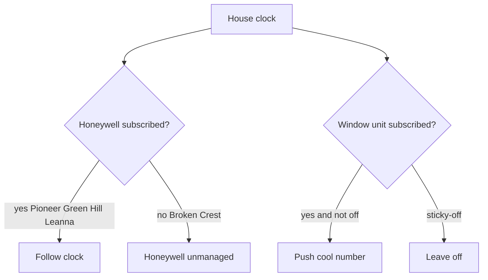

# SmartHome window AC control

## Summary

Remote control of every SmartHome / Midea window AC on the existing account, by the name already in the app, from a machine that is not on house Wi-Fi. A house clock with four slots pushes the cool number to window units that opt in. The operator can set a unit or turn it off by name.

---

## Problem Frame

Houses already have Honeywell control through Total Connect Comfort. Some rooms stay uncomfortable because central air does not reach them, so those rooms have window units that live only in the SmartHome iPhone app. The operator is not on house Wi-Fi. Today that means a second app, no house clock, and no way to hold a setpoint from the same machine that already runs Honeywell.

---

## Key Decisions

- **Cloud, not LAN.** Day-to-day control goes through the SmartHome account. LAN discovery is real on the house network and is not reachable from the operator's machine.
- **House clock, devices opt in.** One four-slot clock per house (morning / afternoon / evening / night). Honeywell and each window unit subscribe separately. Pioneer, Green Hill, and Leanna Honeywell stay subscribed. Broken Crest Honeywell stays off the clock.
- **House override is Honeywell-only.** A manual Honeywell setpoint does not move window units. They stay on the clock.
- **Off beats the clock.** Turning a unit off keeps it off until the operator sets a temp or turns it on. A manual setpoint holds only until the next slot.
- **Target by SmartHome name.** A house Honeywell target never moves window units. Window units are addressed by the name already in the app.
- **Cool number only.** Window units receive the clock's cool setpoint. Heat is ignored.
- **All units on the account.** A new AC in that SmartHome home is in scope once its name maps to a house.

---

## Actors

- A1. Operator — sets or turns off a unit by SmartHome name, and edits house clocks.
- A2. House clock — four time slots, each with a cool number.
- A3. Honeywell at a house — may or may not subscribe to that clock.
- A4. Window unit — identified by SmartHome name; may subscribe to the house clock unless sticky-off is set.

---

## Key Flows

- F1. Set by name
  - **Trigger:** Operator names a SmartHome unit and a cool temp.
  - **Steps:** Unit turns on if needed and takes that temp. Watcher holds it until the next clock slot.
  - **Outcome:** Unit is on at the named temp. Sticky-off is cleared.
  - **Covered by:** R3, R6, R8

- F2. Turn off by name
  - **Trigger:** Operator turns a SmartHome unit off.
  - **Steps:** Unit powers off. Sticky-off is set.
  - **Outcome:** Later clock slots do not turn it back on.
  - **Covered by:** R4, R7

- F3. Slot advances
  - **Trigger:** The house clock enters a new slot.
  - **Steps:** Each opted-in window unit that is not sticky-off receives that slot's cool number. Subscribed Honeywell is unchanged by this work except where it already follows the clock.
  - **Outcome:** Window units match the new cool number. Off units stay off.
  - **Covered by:** R5, R7, R9, R10

- F4. House Honeywell override
  - **Trigger:** Operator sets Honeywell at a house (for example afternoon 78).
  - **Steps:** Honeywell changes. Window units at that house are not touched.
  - **Outcome:** Window units stay on the clock (or stay off).
  - **Covered by:** R2, R5

- F5. Unmapped or new unit
  - **Trigger:** Operator sets a unit whose name does not identify a house, or a new AC appears on the account.
  - **Steps:** Set and off still work by name. Clock apply happens only after the name maps to a house.
  - **Outcome:** No silent no-op on set/off. No invented clock.
  - **Covered by:** R3, R4, R11, R12

---

## Requirements

**Addressing and reach**

- R1. Every air conditioner on the SmartHome home used in the iPhone app is controllable from the operator's machine without joining house Wi-Fi.
- R2. A house Honeywell target does not change any window unit.
- R3. The operator can set a window unit to a cool temp by the name shown in SmartHome.
- R4. The operator can turn a window unit off by that same name.

**House clock**

- R5. Each house has one clock with four slots: morning, afternoon, evening, night. Window units that opt in receive that slot's cool number.
- R6. A setpoint issued by name holds until the next slot at that house, then the clock takes over.
- R7. Off issued by name persists across slot changes until the operator sets a temp or turns the unit on.
- R8. Setting a temp by name clears sticky-off.
- R9. Pioneer, Green Hill, and Leanna window units ride the existing Honeywell clocks at those houses. Those Honeywell subscriptions do not change.
- R10. Broken Crest gets the same four-slot pattern for window units only. Broken Crest Honeywell stays unmanaged.
- R11. A window unit rides a clock only when its SmartHome name identifies the house. Unmapped units accept set and off and do not receive clock pushes.

**Account and safety**

- R12. A new AC added to that SmartHome home is in scope. Clock apply starts only after the name maps to a house.
- R13. Existing Honeywell set and enforce behavior at occupied houses does not change as a side effect of adding window-unit control.
- R14. If one window unit fails to apply, other units and Honeywell continue. The operator is told which unit failed.

---

## Acceptance Examples

- AE1. Broken Crest override
  - **Covers R2, R5, R10.**
  - **Given:** Broken Crest window units are on the afternoon slot.
  - **When:** The operator sets Broken Crest Honeywell to 78.
  - **Then:** Honeywell becomes 78. Window units stay on the afternoon cool number.

- AE2. Off survives noon
  - **Covers R4, R7.**
  - **Given:** A unit was turned off at 10am. The next slot is 12pm at 75.
  - **When:** Noon arrives.
  - **Then:** The unit is still off.

- AE3. Set, then slot
  - **Covers R3, R6, R8.**
  - **Given:** A unit is sticky-off or at some other temp.
  - **When:** The operator sets it to 72, then the next slot arrives at 75.
  - **Then:** It goes to 72 immediately, then to 75 at the slot.

- AE4. House target leaves windows alone
  - **Covers R2.**
  - **Given:** Pioneer has Honeywell and a window unit.
  - **When:** The operator sets Pioneer Honeywell the way they do today.
  - **Then:** The window unit does not move.

- AE5. Unmapped name
  - **Covers R3, R4, R11.**
  - **Given:** A SmartHome name does not identify a house.
  - **When:** The operator sets 72 or turns it off.
  - **Then:** The command applies. No clock push is invented for that unit.

---

## Scope Boundaries

**Deferred for later**

- Per-room cool numbers that diverge from the house clock
- Occupancy or vacant setbacks for window units
- Mode and fan as operator commands
- A dashboard or morning-scrape view of window units as a product
- Enrolling Broken Crest Honeywell on the new clock

**Out of v1**

- Requiring the operator's machine to be on house Wi-Fi
- An on-site box as the control path
- Changing Honeywell set or enforce behavior in order to add window units

---

## Dependencies / Assumptions

- The SmartHome account already has the units (home name truncated as Liaisonventuresman... in the app).
- SmartHome display names include a house identifier (street), matching how they appear today.
- The operator will supply the four Broken Crest cool numbers before that clock is enabled. Planning does not invent them.
- Reads of indoor temp and power exist only so the watcher can hold state. They are not a product surface in v1.
- Occupancy data in this repo stays unrelated to window-unit control.

---

## Outstanding Questions

**Deferred to Planning**

- How the SmartHome cloud session is obtained and refreshed.
- How often the watcher re-applies a slot.
- Where sticky-off is stored and how the operator sees it.
- Exact Broken Crest cool numbers — collected from the operator before that clock is enabled, not invented here.

---

## Sources

- App on the phone is SmartHome / MSmartHome (Midea), Android package `com.midea.ai.overseas`. Units on the account are type AC.
- Midea devices speak a LAN protocol (UDP discovery, local control). Newer units need a one-time cloud token/key. That path only works from the house network. Public local tooling: [msmart-ng](https://pypi.org/project/msmart-ng/) and [midea-ac-py](https://github.com/mill1000/midea-ac-py).
- Existing HVAC is Honeywell Total Connect Comfort: `thermostat/scraper.py`, `thermostat/set_temps.py`, `thermostat/schedule.py`.
- Current clocks live in `thermostat/config/schedules.json` for `1404 pioneer`, `3406 green hill`, and `6623 leanna` only. `1025 broken crest` is a Honeywell location in `thermostat/output/latest.json` and has no clock today.
- `CLAUDE.md` requires a safe occupied-schedule test window before changing Honeywell set or enforce behavior.
