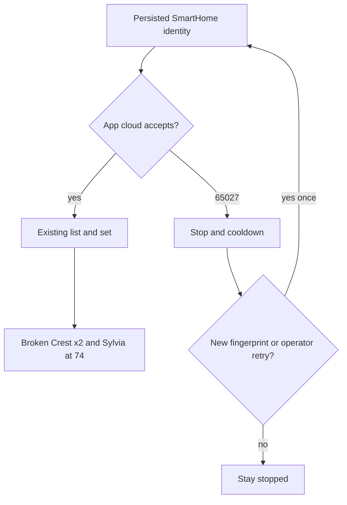

# SmartHome cloud login from the Mac

## Summary

Get one working SmartHome-app-cloud login from the operator Mac while the iPhone app stays logged out, then use the existing CLI to list units and set both Broken Crest window ACs plus one Sylvia unit to 74. Hunt a single accepted client identity, persist it, and stop on 65027 instead of retrying.

---

## Problem Frame

The window-AC CLI already exists and talks to the SmartHome app cloud. Email and password in the root env file are accepted far enough to return 65027 (too many online devices), including after logout and a password change. NetHome Plus says the account does not exist. The Midea US website says the user is not registered or the password is wrong. Those are different account silos, not the app the phone uses. The operator has no proxy tools and will not capture phone traffic. The job is blocked on login, not on missing set/off behavior.

---

## Key Decisions

- **Mac-only hunt.** Stay logged out of the iPhone SmartHome app. No phone traffic capture. No NetHome Plus account. No Midea website login.
- **Same silo as the phone app.** Only the SmartHome app cloud counts. A working website or NetHome Plus login is not success.
- **One client identity.** The Mac presents one stable published SmartHome client fingerprint and reuses it. New identities on each attempt are out.
- **65027 means stop.** Cooldown already exists. Do not loop retries. One later attempt is allowed after a real change (new fingerprint or operator-approved wait).
- **Existing CLI is the consumer.** Once login works, list and set/off stay as they are. This work does not change house clocks, Honeywell, or watcher install.
- **Wrong-silo errors are expected.** NetHome Plus "account does not exist" and the US website "not registered" do not mean the SmartHome password is wrong.

---

## Actors

- A1. Operator — stays logged out of the phone app, supplies SmartHome email/password in the root env file, asks for a list/set.
- A2. Mac SmartHome client — one persisted identity; logs in, lists, sets.
- A3. SmartHome app cloud — accepts or rejects that identity (65027 or success).
- A4. Existing CLI — list / set / off once A2 has a session.

---

## Requirements

**Reach**

- R1. The operator Mac obtains a SmartHome app-cloud session without the iPhone app being logged in.
- R2. That session can list every AC on the SmartHome home and set a unit by the name already in the app.

**Identity and retries**

- R3. The Mac uses one persisted client identity across attempts. It does not mint a new identity per login.
- R4. After 65027, the client stops for that attempt. It does not retry in a loop.
- R5. A later login attempt happens only after a new published SmartHome fingerprint is tried, or after the operator asks for one retry following a wait.

**Set spike**

- R6. After the first successful list, set both Broken Crest units and one Sylvia unit to 74, then report live read-back.
- R7. Failed login does not write hold or sticky-off intent.

**Safety**

- R8. Passwords, tokens, and auth bodies are never logged or posted to Discord. CLI 65027 stays on stderr.
- R9. Honeywell set/enforce and the SmartHome watcher install stay unchanged. No live watcher until a set/off spike has succeeded.

---

## Key Flows

- F1. Hunt a login
  - **Trigger:** Operator asks to list or set while the phone is logged out.
  - **Steps:** Present the persisted SmartHome identity. On success, keep that identity. On 65027, stop and cooldown. On a new published SmartHome fingerprint, try once with that identity persisted.
  - **Outcome:** A session, or a single 65027 with no retry storm.
  - **Covered by:** R1, R3, R4, R5

- F2. First useful set
  - **Trigger:** List succeeds.
  - **Steps:** Identify both Broken Crest ACs and one Sylvia AC by SmartHome name. Set each to 74. Read back.
  - **Outcome:** Those units are at 74, or named failures, without touching Honeywell.
  - **Covered by:** R2, R6, R7, R9

---

## Acceptance Examples

- AE1. Phone logged out, first Mac login returns 65027
  - **Covers R4, R7.**
  - **Given:** iPhone SmartHome is logged out. Env has the SmartHome email and password.
  - **When:** The operator lists units.
  - **Then:** The attempt stops. Intent is unchanged. Discord does not get the 65027 text.

- AE2. A new published SmartHome fingerprint is tried
  - **Covers R3, R5.**
  - **Given:** The previous identity got 65027.
  - **When:** Planning selects another published SmartHome-silo fingerprint.
  - **Then:** That identity is persisted and tried once. NetHome Plus and the US website are not tried as the login target.

- AE3. Login succeeds
  - **Covers R1, R2, R6.**
  - **Given:** List returns the home's ACs.
  - **When:** The operator wants the agreed spike.
  - **Then:** Both Broken Crest units and one Sylvia unit are set to 74 and read back.

---

## Success Criteria

- A Mac list works while the phone app is logged out.
- The agreed three units can be set to 74 through the existing CLI path.
- 65027 never produces a retry loop or a Discord dump of the Chinese error text.

---

## Scope Boundaries

**Deferred for later**

- Watcher LaunchAgent install (still gated on a live set/off spike).
- Broken Crest house-clock cool numbers.
- Logging back into the phone after the Mac session works.

**Outside this work**

- Phone traffic capture, HTTPS interception, or pinning bypass.
- Creating or using a NetHome Plus account.
- Logging in at the Midea US website.
- LAN discovery from house Wi-Fi.
- Changes to Honeywell set or enforce.

---

## Dependencies / Assumptions

- The env email and password are the SmartHome app account, not Honeywell or PadSplit.
- 65027 after password change means the cloud is rejecting this Mac client identity, not that the password is wrong.
- Published SmartHome client fingerprints exist that still target the same app silo. Whether any of them are accepted is unknown until tried.
- The existing CLI can set and list once `connect` succeeds.

---

## Outstanding Questions

**Deferred to Planning**

- Which published SmartHome-silo client fingerprints to try, and in what order.
- How long to wait before one operator-requested retry if every fingerprint still returns 65027.
- Whether a successful session can be reused across CLI invocations without a fresh login each time.

---

## Sources / Research

- Origin control job: `docs/brainstorms/2026-08-28-smarthome-window-ac-requirements.md` (cloud, not LAN; target by SmartHome name).
- Current client and 65027 cooldown: `docs/plans/2026-08-28-001-feat-smarthome-window-ac-plan.md`, `smarthome/cloud.py`, `smarthome/session.py`.
- Live evidence: MSmartHome-silo login returns 65027 after logout and password change; NetHome Plus reports no account; Midea US website reports unregistered or wrong password.
- Community 65027 reports on US SmartHome cloud logins: [HA issue 238](https://github.com/nbogojevic/homeassistant-midea-air-appliances-lan/issues/238).
