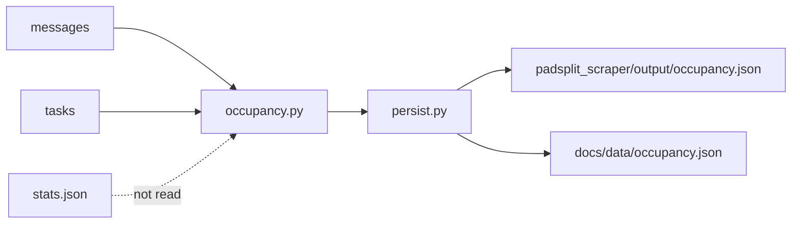
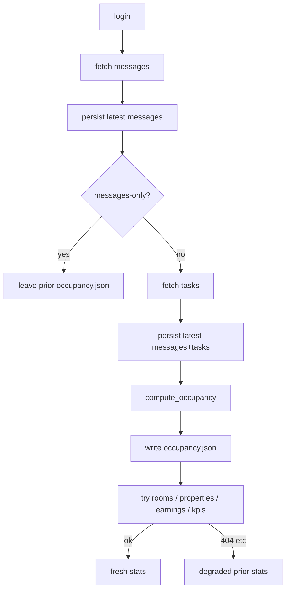
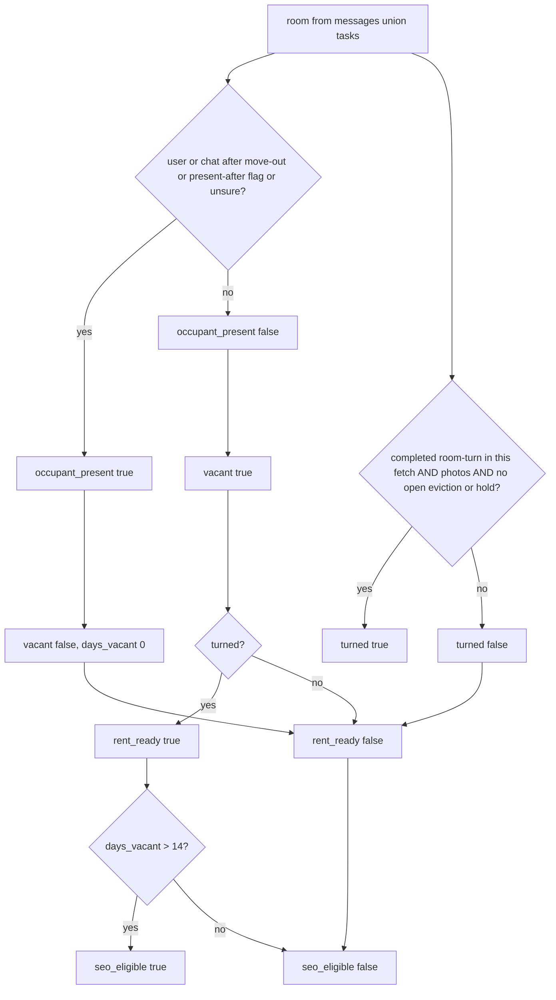

# feat: Derive occupancy.json from messages and tasks

## Summary

Add a rolling `occupancy.json` derived from live `latest.json` messages and tasks. One row per room seen in those sources. Presence, vacant, turned, rent-ready, and `seo_eligible` follow the rules below. This PR is the file plus the Broken Crest regression. Operator dashboards and Discord still read `vacancy_rooms` until PR 2. Nest and Scout may later read `seo_eligible` only. This scrape never publishes.

---

## Problem Frame

`stats.json` is stale. Earnings `/api/partner/earnings/` 404s, the full scrape marks `run_status.state=degraded`, and prior May 2026 stats are rewritten. `kpis.vacancy_rooms` is listed-status, not presence. 1025 Broken Crest Rm 3 / property `31523` still has Curtis Palmer on the occupancy, an active host chat after the 2026-06-29 move-out, eviction ticket `433568` with `is_present_after_move_out: true`, and zero move-out photos. A date check or `vacancy_rooms` read would invent empty. This PR writes that derived file and locks 1025 Broken Crest Rm 3 as present and not rent-ready. Live operator surfaces still read `vacancy_rooms` until PR 2.

---

## Requirements

### Source and row shape

- R1. Occupancy is derived from the current messages list and tasks buckets only. It does not read `stats.json`, `vacancy_rooms`, partner rooms, or May 15 stats.
- R2. The file is one row per room in the messages ∪ tasks universe, joined on normalized street (`street1`, trailing street-type tokens stripped) and room number. Chat-only rows may have null `property_id`. Task-backed rows take `property_id` from the ticket.
- R3. Each row has exactly `property_id`, `address`, `room_number`, `occupant_present`, `listed_move_out`, `next_move_in` (future `moveInDate` only, else null), `open_turn_ticket_ids`, `open_eviction_ticket_ids`, `open_hold_ticket_ids`, `move_out_photos`, `vacant`, `turned`, `rent_ready`, `days_vacant`, `seo_eligible`.
- R4. `compute_occupancy` and persist emit only the R3 keys. The payload never includes `room_code`, lock codes, PINs, `codes.html` values, occupant `user` / `name` / `reported_by`, `lastMessage` text, `extra_data`, `media`, ticket `details`, or `has_reused_code`. Ticket `room_code` (Broken Crest Rm 3 is `7633`) is dropped.

### Presence and derived flags

- R5. `occupant_present` is true if the source chat's `occupancy.user` is present, or host chat still has a `lastMessage` after listed move-out (broadcasts and `TICKET_UPDATE` count), or ticket `extra_data.is_present_after_move_out` is true. If unsure, present. `moveOutDate < today` alone never empties a room. Vacant stays `not present`; do not require a completed turn to empty a room.
- R6. `vacant` is not present. `turned` is a completed `room-turn` ticket in this fetch, plus `move_out_photos > 0`, plus no open eviction or hold. `turned` is independent of vacant. `rent_ready` is vacant and turned. `seo_eligible` is rent-ready and `days_vacant > 14`.
- R7. 1025 Broken Crest Rm 3 / property `31523` is `occupant_present: true`, `rent_ready: false`, `seo_eligible: false` on the live Curtis Palmer / ticket `433568` fixture. This acceptance does not change.

### Pipeline

- R8. Occupancy is computed after tasks persist and outside the rooms/properties/earnings try-block. An earnings 404 still writes occupancy and still exits 0.
- R9. `--messages-only` does not rewrite occupancy. The prior file stays.
- R10. Occupancy is a rolling pair: `padsplit_scraper/output/occupancy.json` and `docs/data/occupancy.json`. Both carry the full R3 row, not a `seo_eligible`-only Pages projection. Morning commit and `scrape.yml` include it. No timestamped occupancy snapshots.

---

## Key Technical Decisions

- KTD1. **Pure function, `kpis.py` shape.** `compute_occupancy(messages, tasks, now)` in `padsplit_scraper/occupancy.py` with dual import. Scraper stays orchestrator. Persist writes JSON. Same split as `REFACTOR-AUDIT-2026-07-18.md`.
- KTD2. **Universe is messages ∪ tasks.** Chats have no `property.id`. Partner rooms live inside the earnings try-block, so they cannot be the catalog without blocking on the 404. Rooms with no chat and no ticket are absent this PR.
- KTD3. **Skip occupancy on `--messages-only`.** Afternoon would otherwise drop ticket `433568` and can flip Curtis toward `seo_eligible`. Matches the existing skip of tasks and stats.
- KTD4. **`turned` is snapshot-only.** Live `Complete` often has no aged-out room-turn. `turned` is true only when a completed `room-turn` is in this fetch. Prior occupancy is not a memory of turned.
- KTD5. **Presence is OR across sources for one room.** Merge on `(normalized street1, room_number)`. Normalized street is lowercase trimmed `street1` with trailing street-type tokens stripped (`rd`, `dr`, `ave`, `st`, `street`, `road`, `drive`, `avenue`) so `1025 Broken Crest` and `1025 Broken Crest Rd` are one row. Listed move-out is the latest `moveOutDate` / ticket `extra_data.move_out_date`. Next move-in is the earliest `moveInDate` after the Chicago date of `now`.
- KTD6. **`days_vacant` is 0 while present.** Otherwise whole Chicago calendar days from listed move-out. When `listed_move_out` is null, treat presence as unsure (`occupant_present` true, `days_vacant` 0, `seo_eligible` false). `seo_eligible` is rent-ready and `days_vacant > 14` (14 is not eligible). Occupancy uses America/Chicago, same as `obsidian_daily_digest.py`.
- KTD7. **A user on a future move-in is present.** The stated rule is the source chat's `occupancy.user` is present. That blocks `seo_eligible`. Incoming-list handling is PR 2.
- KTD8. **Open ticket lists are exclusive.** `open_eviction_ticket_ids` from `status == eviction`. `open_hold_ticket_ids` from `status == on_hold`. `open_turn_ticket_ids` from category `room-turn` / `ROOM_TURN` among remaining `kpis.py` open statuses (`submitted`, `accepted`, `in_progress`). Ticket `433568` is eviction-only; category never overrides eviction or hold. A completed turn is still category `room-turn` / `ROOM_TURN` with a completed status. Unclassified or laundry tickets do not complete a turn.
- KTD9. **`move_out_photos` is the max of** ticket `moveout_photos_count`, `len(media)`, and `MOVE_OUT_PHOTOS` attachment count. `turned` needs that max > 0.
- KTD10. **Occupancy failure does not abort earnings.** Own try, log, continue. One bad room defaults present and stays in the file. Do not raise uncaught through `_run_phase`.
- KTD11. **Persist writes both rolling paths with the full R3 row.** `padsplit_scraper/output/occupancy.json` (canonical, like stats) and `docs/data/occupancy.json` (Pages, like monthly history). Do not split a public `seo_eligible`-only projection. `scrape.yml` still copies. Envelope: `{scraped_at, derived_from: ["messages", "tasks"], rooms: [...]}` sorted by address then room.

---

## High-Level Technical Design

### Components and data flow

### Scrape placement

### Flag derivation

---

## Scope Boundaries

**In scope:** derive and persist occupancy; Broken Crest Rm 3 present and not rent-ready; full-scrape placement; rolling-file wiring.

**PR 2 (do not start here):**

- Incoming list from future `moveInDate` (Kenneth Friday).
- Dashboard rent-ready vs occupied-after-move-out lists.
- Mark `stats.json` stale in the UI, or refresh stats from a working endpoint, and stop `docs/stats.html` / `slack_task_digest.py` from treating `vacancy_rooms` as occupancy.

**Deferred past PR 2:**

- Future `moveInDate` as an extra `seo_eligible` block beyond the stated formula.
- Portfolio-complete room catalog from partner rooms when that fetch succeeds.
- Memory of `turned` after completed tickets age out of the API.

**Outside this PR:**

- PadSplit product email scrape.
- Discord channel writes.
- Listing SEO draft or publish. Nest/Scout are readers later, not writers here.
- Lock codes, PINs, or `codes.html` values in occupancy.
- Auto-fine, auto-evict, auto-publish.
- A new agent. Cindy → Don stays a phone call.
- Thermostat enforcement.

---

## Implementation Units

### U1. Occupancy derivation and Broken Crest tests

**Goal:** Pure function that turns messages and tasks into occupancy rows and flags.

**Requirements:** R1, R2, R3, R4, R5, R6, R7

**Dependencies:** None

**Files:**

- Create `padsplit_scraper/occupancy.py`
- Create `test_padsplit_occupancy.py`

**Approach:** `compute_occupancy(messages, tasks, now)` returns the envelope. Walk chats and every task bucket. Join on street + room. Apply KTD5–KTD9. Dual import like `kpis.py`. No HTTP. No `stats.json`.

**Execution note:** Implement this module test-first. Start with the Broken Crest fixture so the acceptance case fails before the function exists.

**Patterns to follow:** `padsplit_scraper/kpis.py` and `test_padsplit_kpis.py` — stdlib `unittest`, injected `now`, helpers that swallow bad dates.

**Test scenarios:**

- Covers R7. Curtis Palmer / 1025 Broken Crest Rm 3 / property `31523`: `occupancy.user` present, `moveOutDate` 2026-06-29, host `lastMessage` 2026-08-19 (parking broadcast), eviction ticket `433568`, `is_present_after_move_out` true, `moveout_photos_count` 0, ticket `room_code` `7633`. Expect `occupant_present` true, `vacant` false, `turned` false, `rent_ready` false, `seo_eligible` false, `property_id` 31523 from the ticket, `move_out_photos` 0, `433568` in `open_eviction_ticket_ids` and not in `open_turn_ticket_ids`, room keys equal the R3 allowlist, no `room_code` key. Same join when one source says `1025 Broken Crest Rd`.
- Past `moveOutDate`, user present, dead chat: still present.
- Past `moveOutDate`, user null, lastMessage after move-out: present.
- Past `moveOutDate`, user null, dead chat, no present-after flag, no tickets: vacant, not turned.
- `is_present_after_move_out` true alone: present.
- Missing occupancy object or null room number: present if unsure, no crash.
- Structured vacant + turned: no user, no present-after, completed `room-turn`, photos 2, no open eviction/hold, `days_vacant` 10 → `rent_ready` true, `seo_eligible` false. Same at 15 → `seo_eligible` true. Same at 14 → not `seo_eligible`. No name or title parse.
- Completed turn + photos + open eviction: not turned.
- Completed turn + photos + `on_hold`: not turned.
- Unclassified completed ticket with photos: does not satisfy turned.
- Future `moveInDate` with a user (Terius-style): present, `next_move_in` set, not `seo_eligible`.
- Chat-only room: row exists, `property_id` null.
- Task-only room, no vacant signal: present.
- Two chats same street + room: present if any source is present; one listed move-out; one future move-in.
- Room number `3` vs `"3"` joins. Category `ROOM_TURN` vs `room-turn` both count as turn among remaining open statuses.
- Each room's keys equal the R3 allowlist. `room_code`, occupant `user` / `name` / `reported_by`, `lastMessage` text, `extra_data`, `media`, ticket `details`, and `has_reused_code` are absent.
- Null `listed_move_out` and no user: present, `days_vacant` 0, not `seo_eligible`.

**Verification:** `python3 test_padsplit_occupancy.py` is green. Broken Crest fixture matches R7. No occupancy function reads stats.

---

### U2. Persist occupancy after tasks, outside earnings

**Goal:** Full scrape writes occupancy from the messages+tasks already on disk. Earnings failure does not skip that write. Messages-only leaves the prior file.

**Requirements:** R8, R9, R10

**Dependencies:** U1

**Files:**

- Modify `padsplit_scraper/persist.py`
- Modify `padsplit_scraper/scraper.py`
- Modify `test_padsplit_scraper.py`

**Approach:** Add `_occupancy_output_path()` and a persist helper that writes output and `docs/data`. In `run()`, after `payload["tasks"]` persist and before the earnings try, compute and write occupancy inside its own try. `--messages-only` returns before tasks and does not call that write.

**Patterns to follow:** `persist._write_json` / `_stats_output_path`. Orchestration tests in `test_padsplit_scraper.py` (`test_stats_failure_reuses_prior_stats_and_marks_run_degraded`, `test_messages_only_skips_tasks_and_stats_fetches`).

**Test scenarios:**

- Full run with tasks writes `occupancy.json` to output and docs/data. Envelope has `derived_from: ["messages", "tasks"]`. Existing snapshot globs that treat unknown `output/*.json` as timestamped files must exclude `occupancy.json`.
- Earnings/rooms raise `ScrapePhaseError`: exit 0, latest still has tasks, prior stats reused, occupancy still written from this run's messages+tasks.
- `--messages-only` does not fetch tasks, does not create occupancy if absent, and does not overwrite a pre-seeded occupancy file.
- Occupancy helper that raises: scrape continues into the earnings try (or degraded path) and exits 0 when earnings is also failed.

**Verification:** `python3 test_padsplit_scraper.py` is green. Occupancy write is not inside the earnings `except`.

---

### U3. Commit and copy the rolling occupancy file

**Goal:** Morning and GitHub Actions persist occupancy the same way they persist stats.

**Requirements:** R10

**Dependencies:** U2

**Files:**

- Modify `run_morning.sh`
- Modify `.github/workflows/scrape.yml`
- Modify `CLAUDE.md`

**Approach:** Add both occupancy paths to the morning `git add` list. Copy `padsplit_scraper/output/occupancy.json` to `docs/data/occupancy.json` in scrape.yml (skip if missing, like stats). Add the docs path to the Actions `git add`. In `CLAUDE.md`, list occupancy next to latest/stats and state that it is presence from messages and tasks; `kpis.vacancy_rooms` remains listed-status and is not presence. Do not change `run_afternoon.sh`, `docs/stats.html`, `docs/index.html`, or `slack_task_digest.py`.

**Test scenarios:**

- `Test expectation: none -- wiring lists only; coverage is the U2 persist tests plus a review that the two add/copy lists include occupancy.json.`

**Verification:** Morning and scrape.yml lists include occupancy. Afternoon list does not. No `202*.json` occupancy snapshots.

---

## Acceptance Examples

- AE1. **Broken Crest stays present and not rent-ready.** Covers R5, R7. Given the live Curtis Palmer chat and eviction ticket `433568`, when occupancy is derived, then Rm 3 / `31523` is `occupant_present: true`, `rent_ready: false`, `seo_eligible: false`, and has no `room_code`.
- AE2. **Earnings 404 does not block occupancy.** Covers R8. Given tasks already persisted and earnings HTTP 404, when the full scrape finishes, then occupancy is fresh and stats stay degraded fallback.
- AE3. **Afternoon does not invent vacant.** Covers R9. Given a prior occupancy file with Curtis present, when `--messages-only` runs, then that file is unchanged.
- AE4. **Bobby vacant and turned is structured.** Covers R6. Given no user, completed `room-turn`, photos, no open eviction/hold, when `days_vacant` is 15, then `rent_ready` and `seo_eligible` are true. A chat title containing "Bobby" does not empty a room.

---

## System-Wide Impact

`occupancy.json` becomes a Pages artifact under `docs/data/` with the full R3 row. Nest and Scout are not in this repo and are not wired here; they may later read `seo_eligible` only. `docs/stats.html` and `slack_task_digest.py` still read `vacancy_rooms` until PR 2. `codes.html` stays gated and unread. Discord and email paths stay untouched.

---

## Risks and Dependencies

- Completed room-turns may be missing from the live Complete bucket, so `turned` / `rent_ready` / `seo_eligible` can stay false until a completed turn is still in the fetch. That is safer than inventing vacant.
- Chat-only rows have null `property_id`. Downstream must tolerate null.
- Address join is normalized `street1` + room. Do not reuse the Discord reply matcher as a vacancy gate.
- Occupancy is only as fresh as the last full scrape (morning / Actions). Afternoon messages do not refresh it.

---

## Sources and Research

- Live fixture: `docs/data/latest.json` Curtis Palmer chat and `tasks.Eviction` ticket `433568`.
- Stale stats: `docs/data/stats.json` `scraped_at` 2026-05-15; `run_status.failed_phase` `earnings_stats`.
- Placement: `padsplit_scraper/scraper.py` `run()` — tasks persist, then earnings try.
- Open ticket statuses: `padsplit_scraper/kpis.py`.
- Rolling outputs: `padsplit_scraper/persist.py`, `run_morning.sh`, `.github/workflows/scrape.yml`.
- No `docs/solutions/` entries exist yet.
