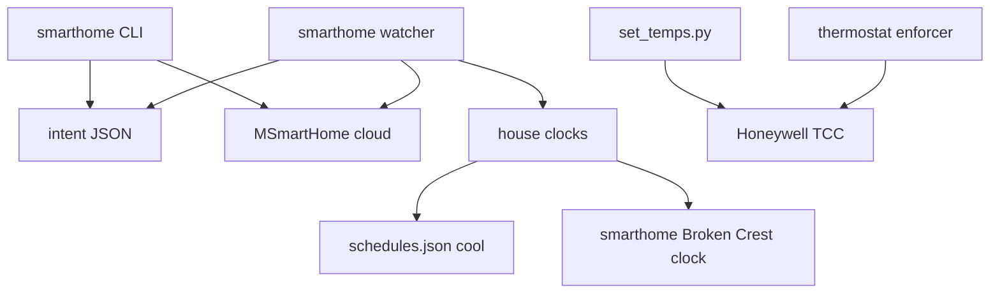
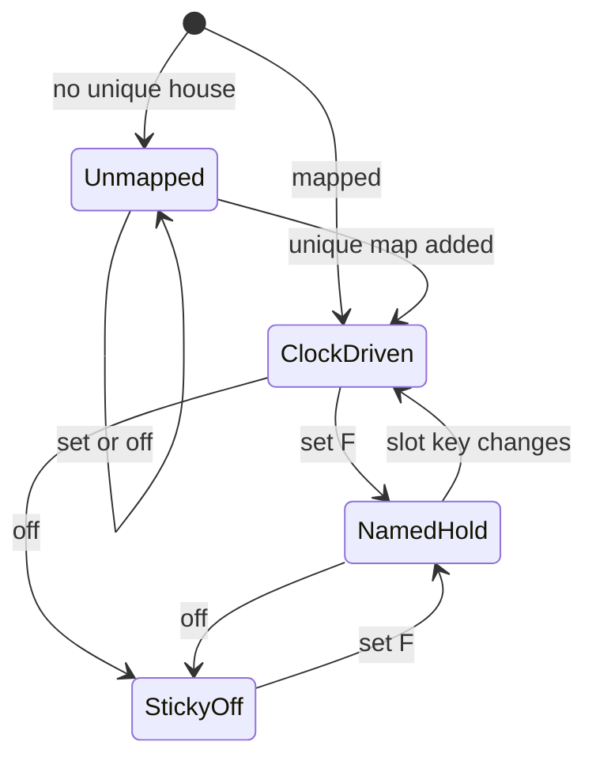
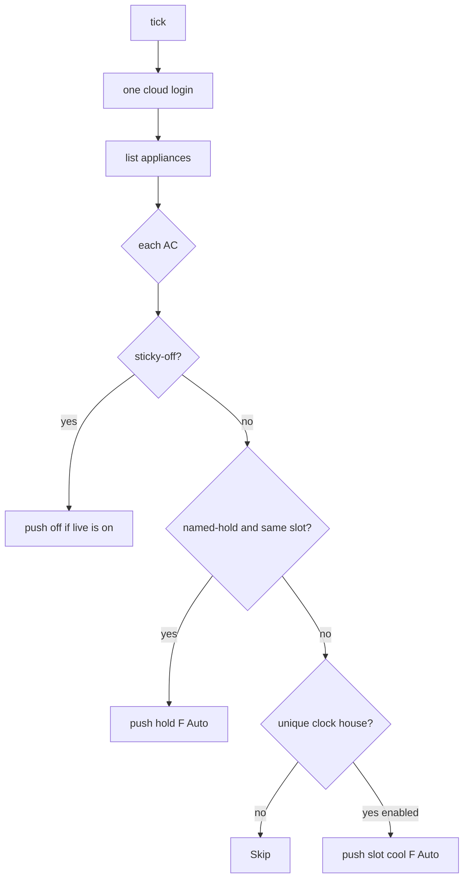

# feat: Add SmartHome window AC control

## Summary

Add a sibling SmartHome path that lists, sets, and turns off Midea window ACs from the operator Mac via the MSmartHome cloud. A watcher enforces operator intent and house-clock cool numbers. Honeywell set and enforce stay untouched.

## Problem Frame

Rooms the central system does not reach already have window units in the SmartHome iPhone app. The operator is not on house Wi-Fi. Honeywell already has house clocks and a 30-minute enforcer. Window units have no clock, no CLI, and no hold. Tenant or phone-app changes currently stick until someone opens the app again.

---

## Requirements

Carried from origin unless marked **plan-added** or **plan delta**.

**Reach and addressing**

- R1. Every AC on the SmartHome home is controllable from the operator Mac without house Wi-Fi.
- R2. Honeywell house targets (`thermostat/set_temps.py`) never change a window unit.
- R3. The operator sets a window unit to one Fahrenheit number by the SmartHome display name. Mode is Auto.
- R4. The operator turns a window unit off by that name.

**Clock and intent**

- R5. Pioneer, Green Hill, and Leanna window units ride those houses' existing clocks. The unit receives the active slot's **cool** number as the Auto target. Heat stays on the clock and is not sent.
- R6. A named setpoint holds until the next slot, then the clock's cool number takes over.
- R7. Off persists across slots until the operator sets a temp. Plan delta: no bare `on`; only set-by-temp clears sticky-off.
- R8. Setting a temp clears sticky-off.
- R9. Those three Honeywell subscriptions do not change.
- R10. Broken Crest gets a four-slot clock for window units only. Broken Crest Honeywell stays out of `thermostat/config/schedules.json` and out of the Honeywell enforcer.
- R11. A unit rides a clock only when its name maps uniquely to Pioneer, Green Hill, Leanna, or Broken Crest. Other names accept set/off only.
- R12. A new AC on the account is controllable by name. Clock apply starts only after a unique house map.

**Safety**

- R13. No edits to `thermostat/set_temps.py` or Honeywell enforce behavior.
- R14. Per-unit continue on failure. Discord names the failed unit. Honeywell is unaffected.

**Plan-added**

- R15. Operator commands are the source of truth. Phone-app and tenant changes — including phone off — are overwritten on the next watcher tick. Sticky-off means the watcher re-pushes off when the unit is on.

---

## Key Technical Decisions

- **KTD1 — Sibling module, not Honeywell.** New `smarthome/` package and `com.padsplit.smarthome.watcher` LaunchAgent. Do not import `thermostat.schedule` or call `enforce_command` / `set_temps`. Read `thermostat/config/schedules.json` as data only. Copy the seven-line `find_active_slot` picker into `smarthome/clocks.py`.
- **KTD2 — Cloud library.** Pin `midea-beautiful-air==0.10.7`. Login with `appname="MSmartHome"`. List via `cloud.list_appliances()` (no LAN discover). Control via `appliance_state(..., use_cloud=True, appliance_type=aircon)`. After every set/off, read back running + target and treat mismatch or offline as failure. U1 is a hard gate: no watcher install until list + set + off + read-back succeed on one real unit. If transparent/send fails with 1000/9999, wrap the send in `smarthome/cloud.py` to emit `applianceCode` (do not edit site-packages). Also confirm Auto holds the requested °F; if Auto cannot, fall back to Cool mode in this wrapper and note it in Open Questions. Rejected: `msmart-ng` / `midea-local`; `coolth`.
- **KTD3 — One Auto number, °F at the edge.** API layer accepts °F, converts with `round((F - 32) * 5 / 9, 1)` °C, sets `mode=Auto` and `running`. Clock-driven default is the slot cool number. CLI hold is whatever °F the operator types. Heat is stored on Honeywell clocks and not sent. Pin tests: 72→22.2, 75→23.9.
- **KTD4 — Separate Broken Crest clock.** Do not add `1025 broken crest` to `thermostat/config/schedules.json` (that would enroll Honeywell). Put Broken Crest slots in `smarthome/config/clocks.json`, disabled until the operator supplies four cool numbers.
- **KTD5 — Intent persisted after ACK plus read-back.** Sticky-off and named-hold write only after a successful set/off and a read-back that matches (running/off and target within 1 °F). Failed or mismatched commands leave prior intent. State lives in gitignored `logs/smarthome_intent.json`.
- **KTD6 — One watcher loop.** Every 15 minutes, per unit: if sticky-off, re-push off when live is on; else if named-hold and slot key unchanged, push hold °F; else if mapped and clock enabled, push slot cool. Phone off without CLI `off` is not sticky-off — the clock or hold turns the unit back on. Same process does hold expiry and clock push. 15 minutes is faster than Honeywell's 30 so tenant/app changes do not last half an hour. Rejected: hooking the Honeywell enforcer; a second process for holds.
- **KTD7 — Clock houses are an allow-list.** Pioneer, Green Hill, Leanna, Broken Crest only. Pebbleshores and Burton clocks are ignored even if a name fuzzy-matches.
- **KTD8 — Name match.** First match the SmartHome name to the allow-list `{pioneer, green hill, leanna, broken crest}`. Then, for the first three, pick the unique `schedules.json` key that contains that house. Broken Crest reads only `smarthome/config/clocks.json`. Zero houses → set/off, no clock. Two houses → fail loud. Never enroll pebbleshores or burton.
- **KTD9 — Discord on CLI and watcher batch failure.** Reuse `post_discord_message`. Same "X/Y OK. Failed: names" shape as `set_temps.py`. After three consecutive all-unit failures, skip further pushes that day and send one escalate alert.
- **KTD10 — One session, file lock, no secret logs.** One login per process. CLI and watcher share `logs/smarthome_session.lock`. On 65027: cooldown flag, alert once, no retry loop that tick. Load root `.env` at runtime; never put passwords in the plist. Never log password, tokens, or auth bodies. Reject setpoints outside 61–88 °F (library AC range).

---

## High-Level Technical Design

Operator commands and the watcher both go through one cloud client. Honeywell stays on its own path.



Per-unit intent:



Watcher tick (directional):



---

## Output Structure

```text
smarthome/
  cloud.py          # login, list, set F, off
  clocks.py         # resolve house + active cool
  intent.py         # sticky-off / named-hold store
  cli.py            # set, off, status, list
  watcher.py        # enforce tick
  config/clocks.json
test_smarthome_cloud.py
test_smarthome_clocks.py
test_smarthome_intent.py
test_smarthome_cli.py
test_smarthome_watcher.py
```

Implementer may adjust names. Per-unit file lists win.

---

## Implementation Units

### U1. Cloud spike and API layer

- **Goal:** From the operator Mac, login, list ACs by display name, set one °F in Auto, and turn off. No LAN.
- **Requirements:** R1, R3, R4
- **Dependencies:** None
- **Files:**
  - `smarthome/cloud.py` (create)
  - `smarthome/requirements.txt` or root install pin (create/modify)
  - `test_smarthome_cloud.py` (create)
  - `.env.example` if present (add `SMARTHOME_EMAIL`, `SMARTHOME_PASSWORD`)
- **Approach:** Wrap `midea-beautiful-air` as above. Convert °F with `round((F - 32) * 5 / 9, 1)`. Filter appliance type to air conditioners. After set/off, read back and fail the call if running/target disagree. Live spike is a hard gate: list, set, off, read-back on one real unit, then restore, before U4 install. If set/off returns 1000/9999, wrap send to use `applianceCode` in `smarthome/cloud.py`. Never log password, tokens, or auth bodies. Treat offline as a named failure.
- **Execution note:** Prove list + set + off on one real unit before writing the watcher.
- **Patterns to follow:** `thermostat/scraper.py` credential load from root `.env`; partial-success later, not in this unit.
- **Test scenarios:**
  - Happy: list returns name + id; set 72 °F sends Auto + 22.2 °C; off sets running false.
  - Edge: unknown name raises before any set; duplicate names fail loud.
  - Error: auth failure surfaces; cloud 65027 is a hard error; offline unit is a failure.
- **Verification:** Unit tests with the library mocked. Live spike prints the account's AC names and moves one unit, then restores.

### U2. House clocks and intent store

- **Goal:** Resolve the Auto target: sticky-off, else named-hold if the slot key is unchanged, else mapped house cool number, else no clock.
- **Requirements:** R5, R6, R7, R8, R10, R11, R12
- **Dependencies:** None (pure; U3/U4 consume it)
- **Files:**
  - `smarthome/clocks.py` (create)
  - `smarthome/intent.py` (create)
  - `smarthome/config/clocks.json` (create)
  - `test_smarthome_clocks.py` (create)
  - `test_smarthome_intent.py` (create)
- **Approach:** Read Pioneer / Green Hill / Leanna cool slots from `thermostat/config/schedules.json`. Broken Crest slots only from `smarthome/config/clocks.json` with an explicit `enabled` flag. Slot key is house + hour:minute. Named-hold expires when that key changes. Persist intent only via functions U3/U4 call after ACK. Mapping: SmartHome name tokens vs allow-listed house keys; unique match required for clock.
- **Patterns to follow:** `find_active_slot` midnight wrap; `logs/temp_alert_state.json` as the gitignored state file pattern.
- **Test scenarios:**
  - Happy: 3pm Pioneer → afternoon cool; named-hold 72 before noon stays 72; after noon slot key change → cool 75. Covers AE3.
  - Pin °C: 72 °F → 22.2, 75 → 23.9, 74 → 23.3.
  - Covers AE2: sticky-off at 10am, noon slot → still off, no target.
  - Edge: Broken Crest disabled → no clock target; unmapped name → no clock; name matching two houses → error; Pebbleshores match → no clock.
  - Edge: persist helpers do not write on a failed-ACK flag from the caller.
- **Verification:** Pure tests, no network. Broken Crest missing from `thermostat/config/schedules.json`.

### U3. Operator CLI

- **Goal:** `list`, `set <name> <F>`, `off <name>`, `status` using U1 + U2.
- **Requirements:** R1, R3, R4, R7, R8, R11, R14. Flows F1, F2, F5.
- **Dependencies:** U1, U2
- **Files:**
  - `smarthome/cli.py` (create)
  - `test_smarthome_cli.py` (create)
- **Approach:** Match by SmartHome display name, not Honeywell house target. `set` turns on, Auto, that °F, clears sticky-off, records named-hold + current slot key after ACK. `off` records sticky-off after ACK. `status` prints name, map, intent (clock / hold °F / off / unmapped), and active cool if mapped. Partial success if a future multi-name flag appears; v1 is one name per invocation. Discord on failure.
- **Patterns to follow:** `thermostat/set_temps.py` argparse + Discord failure text. Do not add `--target` house semantics that would look like Honeywell.
- **Test scenarios:**
  - Happy: set 72 on a mapped name writes hold after mocked ACK; off writes sticky-off after ACK. Covers F1 / F2.
  - Covers AE5: unmapped name still sets/off; status shows unmapped; no clock write.
  - Error: failed cloud set does not change intent; Discord called with the name.
  - Edge: status with empty intent file is readable, not a crash.
- **Verification:** CLI tests with cloud + intent mocked. `thermostat/set_temps.py` unchanged.

### U4. Watcher and LaunchAgent

- **Goal:** Every 15 minutes, push operator intent or slot cool and overwrite the device. Honeywell process stays separate.
- **Requirements:** R5, R6, R7, R9, R10, R13, R14, R15. Flows F3, F4.
- **Dependencies:** U1, U2
- **Files:**
  - `smarthome/watcher.py` (create)
  - `test_smarthome_watcher.py` (create)
  - `README.md` (watcher install notes)
  - `CLAUDE.md` (env vars + LaunchAgent label only — do not rewrite Honeywell ops)
- **Approach:** One login behind the session lock, list, per-unit resolve from U2, push via U1, continue on failure, Discord if any failed. Mid-day first map: if intent has no sticky-off and a unique enabled clock exists, push active cool immediately. Write `~/Library/LaunchAgents/com.padsplit.smarthome.watcher.plist` with `StartInterval` 900, `ProgramArguments` `[venv/bin/python3, smarthome/watcher.py]`, `WorkingDirectory` repo root, logs under `logs/smarthome-watcher.log`. Load `.env` in process. Do not write Honeywell plists or plist env secrets. Broken Crest pushes only when `enabled` is true.
- **Patterns to follow:** Enforcer plist shape from `schedule.py`, different label prefix. Partial-success loop from `set_temps.py`.
- **Test scenarios:**
  - Happy: clock-driven unit gets slot cool Auto; hold unit gets hold F; sticky-off re-pushes off if live is on. Covers F3 / AE2 / AE3.
  - Covers AE1 / AE4: watcher never calls TCC or `set_temps`.
  - Error: one unit fails, others still push; Discord names the failure.
  - Edge: slot key change clears hold and pushes new cool in the same tick; disabled Broken Crest skipped; auth failure alerts and does not flip intent flags.
  - Covers AE6: mocked live temp 68, watcher pushes hold or slot cool.
  - Covers AE7: push uses Auto and the operator/clock cool °F, never the heat field.
  - Integration: watcher + intent + mocked cloud in one test; no TCC URL.
- **Verification:** Watcher tests with cloud mocked. Confirm no Honeywell LaunchAgent labels written. Occupied-house live check only after U1 spike and only on window units.

---

## Acceptance Examples

Origin AE1–AE5 still apply. Added:

- AE6. Tenant changes the app to 68. Next watcher tick pushes hold or slot cool, not 68.
- AE7. Operator types 72. Device is Auto at 72 °F regardless of the clock's heat number.
- AE8. Cloud set fails. Intent file still shows the previous sticky-off or hold.

---

## Scope Boundaries

**In scope:** Cloud spike, intent store, CLI, watcher, Broken Crest clock file, Discord on failure, °F Auto control.

**Deferred for later** (from origin): per-room numbers that diverge from house cool; occupancy setbacks; mode/fan as operator commands; dashboard / morning scrape; enrolling Broken Crest Honeywell.

**Deferred to follow-up work:** extracting shared slot helpers out of `thermostat/schedule.py`; faster-than-15-minute ticks; house-name CLI that sets every window unit at a house.

**Out of v1:** LAN control; on-site box; edits to `thermostat/set_temps.py` or Honeywell enforce; bare `on`; sending heat to the window unit.

---

## System-Wide Impact

- **Honeywell:** read-only use of `schedules.json`. No plist or enforcer change. Occupied-house risk is window units only. F4 is satisfied by isolation: `set_temps.py` is never called.
- **Auth:** extra Midea cloud session. Phone app may get kicked (65027). CLI and watcher share a lock so they do not login together. A 65027 or batch auth failure alerts once, sets cooldown, and must not rewrite intent.
- **Secrets:** `SMARTHOME_EMAIL` / `SMARTHOME_PASSWORD` in root `.env` only.
- **launchd:** new label namespace. Morning scrape pipeline unchanged. Watcher and Honeywell enforcer may run in the same minute; they must not share a process or lock.

---

## Risks and Dependencies

- MSmartHome `transparent/send` may reject `applianceId`. U1 spike + optional `applianceCode` patch.
- Unofficial API can change. Keep the wrapper thin.
- Live set/off on occupied rooms. Spike on one unit, restore, then CLI-only for a day, then enable watcher. Prefer a vacant or already-uncomfortable room for the first spike.
- Operator must supply Broken Crest cool numbers before that clock is enabled.
- `midea-beautiful-air==0.10.7` MIT; Python 3.12 CI.

---

## Open Questions

**Deferred to implementation**

- Exact Broken Crest cool numbers (operator, before enable).
- Whether the live account needs the `applianceCode` patch (U1 spike).
- Exact SmartHome display strings (U1 list).
- Whether Auto holds the requested °F or the wrapper must send Cool (U1 spike).
- Whether a tighter occupied band than 61–88 °F is wanted.

---

## Documentation / Operational Notes

- Document CLI verbs and watcher install in `README.md`.
- Add the two env vars to `CLAUDE.md`'s env list.
- First production enable: watcher off, CLI set/off only, then install the LaunchAgent.
- Do not add window-unit snapshots to git.

---

## Sources

- Origin: `docs/brainstorms/2026-08-28-smarthome-window-ac-requirements.md`
- Honeywell clocks: `thermostat/config/schedules.json` (pioneer, green hill, pebbleshores, burton, leanna). Broken Crest is in `thermostat/output/latest.json` only.
- Enforce isolation: `CLAUDE.md`, `REFACTOR-AUDIT-2026-07-18.md`
- Discord pattern: `thermostat/set_temps.py`, `padsplit_scraper/discord_notifier.py`
- Cloud: [midea-beautiful-air](https://github.com/nbogojevic/midea-beautiful-air) 0.10.7; MSmartHome `list_appliances` is cloud-only; control may need `applianceCode` ([issue 37](https://github.com/nbogojevic/midea-beautiful-air/issues/37)). LAN libraries (`msmart-ng`, `midea-local`) are the wrong model.
- Session limit 65027: [HA issue 238](https://github.com/nbogojevic/homeassistant-midea-air-appliances-lan/issues/238)
