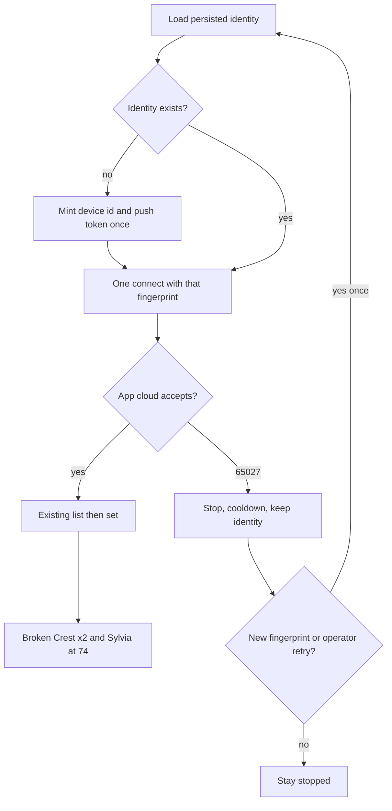
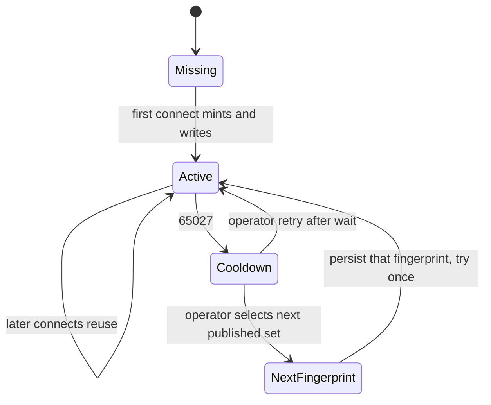

# feat: Persist SmartHome cloud login identity

## Summary

Get one SmartHome-app-cloud session from the operator Mac while the iPhone app stays logged out. Persist a single client identity, try only published SmartHome-silo fingerprints, and stop on 65027. Once list works, set both Broken Crest units and one Sylvia unit to 74 through the existing CLI.

---

## Problem Frame

The window-AC CLI already talks to the SmartHome app cloud. `connect_to_cloud(appname="MSmartHome")` reaches `mp-prod.appsmb.com` and returns 65027. List has never succeeded. NetHome Plus and the Midea US website are different silos and are not the login target. The job is blocked on login identity, not on set/off behavior. (see origin: `docs/brainstorms/2026-08-29-smarthome-cloud-login-requirements.md`)

`smarthome/cloud.py` `connect()` today passes only account, password, and `appname="MSmartHome"`. The library then uses a globally shared default `deviceId` and mints a new `pushToken` on every construction. That is the opposite of one persisted Mac identity.

---

## Requirements

Carried from origin unless marked **plan-added**.

**Reach**

- R1. The operator Mac obtains a SmartHome app-cloud session without the iPhone app being logged in.
- R2. That session can list every AC on the SmartHome home and set a unit by the name already in the app.

**Identity and retries**

- R3. The Mac uses one persisted client identity across attempts. It does not mint a new identity per login.
- R4. After 65027, the client stops for that attempt. It does not retry in a loop.
- R5. A later login attempt happens only after a new published SmartHome fingerprint is selected, or after the operator asks for one retry following a wait.
- R10. **Plan-added.** The persisted identity includes a stable `deviceId` and `pushToken`. It does not reuse the library's shared default device id.

**Set spike**

- R6. After the first successful list, set both Broken Crest units and one Sylvia unit to 74, then report live read-back.
- R7. Failed login does not write hold or sticky-off intent.

**Safety**

- R8. Passwords, tokens, and auth bodies are never logged or posted to Discord. CLI 65027 stays on stderr.
- R9. Honeywell set/enforce and the SmartHome watcher install stay unchanged. No live watcher until a set/off spike has succeeded.

---

## Assumptions

- The env email and password are the SmartHome app account. 65027 after logout and password change means this client identity is rejected, not that the password is wrong.
- `logs/` stays gitignored. Identity JSON belongs there with cooldown and intent.
- Exact SmartHome display names for the two Broken Crest units and the Sylvia unit are unknown until list succeeds. Do not invent them. Padsplit occupancy uses 2516 Sylvia; Honeywell has 2521 Sylvia. Those are different houses. The spike target is whichever Sylvia name appears on the SmartHome list, not a Honeywell location name.
- A successful `connect()` is enough for the existing list/set path. Session-token reuse across CLI processes is not required for the first spike.
- Published SmartHome-silo fingerprints exist. Whether any are accepted is unknown until one operator-approved live try.

---

## Key Technical Decisions

- **KTD1 — Stay on the existing library and CLI.** Keep `midea-beautiful-air==0.10.7`. `connect()` remains the only login entry. List, set, and off stay in `smarthome/cloud.py` and `smarthome/cli.py`. Do not switch to `msmart-ng`, `midea-local`, LAN discovery, or a second package. Rejected: creating a NetHome Plus account or logging in at medi.com.

- **KTD2 — Persist device id and push token, not just appname.** `connect_to_cloud` already accepts `device_id` and `pushtoken`. Today those are omitted, so the library uses `deviceId=c1acad8939ac0d7d` (shared by every 0.10.7 client) and `token_urlsafe(120)` (new every process). Persist one Mac-local pair under `logs/` using the same atomic JSON write as `smarthome/intent.py`. Never mint a replacement on a later `connect()`. 65027 does not rotate the identity.

- **KTD3 — Fingerprint hunt is one published SmartHome-silo set at a time.** Order:
  1. `msmarthome` — library `SUPPORTED_APPS["MSmartHome"]` (appid 1010, `mp-prod.appsmb.com`, proxied v5) plus the persisted local identity.
  2. `msmarthome-slim` — same silo keys and URL, mill1000-published slimmer `/mj/user/login` body (no hardcoded `2.22.0` app/os version block). Reuse the same persisted `deviceId` and `pushToken`.
  Stop after that list. Do not try `NetHome Plus`, `Midea Air`, `Ariston Clima`, `OS Comfort`, Meiju China (`mp-prod.smartmidea.net`), or the Midea partner V2 API. Those are other silos or unpublished partner credentials.

- **KTD4 — No in-process fingerprint loop.** `connect()` loads one fingerprint and tries once. Selecting the next fingerprint is a later attempt: write the new fingerprint into the identity file, then one CLI invocation. That selection is a real change and may run even if the 65027 cooldown is still active. Same-fingerprint retry still honors the existing one-hour cooldown and requires an operator ask.

- **KTD5 — 65027 still means stop.** Keep `SmartHomeSessionLimitError`, `logs/smarthome_cooldown.json`, and the CLI stderr path. Do not Discord the 65027 text. Do not call `record_hold` / `record_off` on failed login. The library already raises on 65027 instead of treating it as a retryable API code; do not add a wrapper retry. Do not copy Honeywell's three-retry login. Watcher first-hit 65027 currently interpolates `{exc}` into Discord (`smarthome/watcher.py`); change that notify to a short English label even though this plan does not load the agent.

- **KTD6 — Session tokens are not persisted in this plan.** One login per process stays. Reusing `accessToken` / `uid` across CLI invocations is deferred unless a first login succeeds and a later process then gets 65027.

- **KTD7 — Spike uses existing CLI after list.** Identify the two Broken Crest ACs and one Sylvia AC from the live list by SmartHome name. Set each to 74 and print read-back. Three CLI `set` calls. Do not use Honeywell names (`1025 broken crest` thermostat, `2521 Sylvia` / `SYLVIA ST`). A Sylvia SmartHome name will be unmapped in `clocks.py`; set still works. No watcher plist load. No Honeywell writes.

---

## High-Level Technical Design

Login hunt (one identity, one try):

Identity lifecycle:

`connect()` stays the consumer seam. CLI and watcher already call it. Watcher install remains gated.

---

## Implementation Units

### U1. Persist one client identity

- **Goal:** Every `connect()` presents the same `deviceId` and `pushToken`. The first call mints them. Later calls reuse them.
- **Requirements:** R3, R8, R10
- **Dependencies:** None
- **Files:**
  - `smarthome/identity.py` (create)
  - `smarthome/cloud.py` (modify)
  - `test_smarthome_identity.py` (create)
  - `test_smarthome_cloud.py` (modify)
- **Approach:** Gitignored JSON under `logs/`, same atomic write pattern as `smarthome/intent.py`. Store fingerprint name, `device_id`, and `pushToken` only. `connect()` loads that record and passes `device_id` and `pushtoken` into `connect_to_cloud`. Do not pass the library default device id. Do not log or Discord the file contents.
- **Execution note:** Test-first for mint-once and reuse. Do not run a live cloud login in this unit.
- **Patterns to follow:** `smarthome/intent.py` load/save; `smarthome/session.py` `logs/` paths; existing `connect_fn` injection in `cloud.connect`.
- **Test scenarios:**
  - Happy: missing file → mint once, write JSON, `connect_fn` receives that `device_id` and `pushtoken`.
  - Happy: existing file → second `connect()` sends the same pair and does not rewrite a new pair.
  - Edge: corrupt or partial JSON → treat as missing, mint once, write a complete record.
  - Error: `connect_fn` raises 65027 → identity file is unchanged.
  - Error: auth error 3101 → identity file is unchanged.
- **Verification:** Unit tests with `connect_fn` mocked. No network. Identity path is injectable for tests.

### U2. One-at-a-time SmartHome-silo fingerprint

- **Goal:** The Mac can try the next published SmartHome-silo fingerprint once, without a retry loop and without leaving the SmartHome silo.
- **Requirements:** R1, R5
- **Dependencies:** U1
- **Files:**
  - `smarthome/identity.py` (modify)
  - `smarthome/cloud.py` (modify)
  - `test_smarthome_identity.py` (modify)
  - `test_smarthome_cloud.py` (modify)
- **Approach:** Default fingerprint is `msmarthome`. A later selection writes `msmarthome-slim` into the identity file and is tried on the next `connect()`. `connect()` never iterates the table. `msmarthome-slim` stays on appid 1010 and `mp-prod.appsmb.com`. If the library kwargs cannot express the slimmer login body, add a thin wrap in `smarthome/cloud.py` (same style as the existing `applianceCode` send wrap). Do not edit site-packages. Do not add NetHome Plus or other `mapp.appsmb.com` apps to the table.
- **Patterns to follow:** `cloud._install_appliance_code_retry` as the model for a library wrap; origin F1 for stop-then-later.
- **Test scenarios:**
  - Happy: default fingerprint is `msmarthome` and `connect_fn` is called with `appname="MSmartHome"`.
  - Happy: after an explicit fingerprint write of `msmarthome-slim`, the next `connect()` uses that shape once.
  - Covers AE2: selecting the next fingerprint persists it and does not target NetHome Plus or the US website.
  - Error: unknown fingerprint name fails before any cloud call.
  - Error: `connect()` on 65027 does not advance the fingerprint by itself.
- **Verification:** Mocked `connect_fn` / wrapped login. Assert one call per `connect()`. Assert forbidden app names are absent from the table.

### U3. Lock 65027 stop and failed-login intent

- **Goal:** A 65027 attempt stops, cooldown starts, stderr reports it, Discord does not get the Chinese error text, and intent is unchanged.
- **Requirements:** R4, R7, R8
- **Dependencies:** U1
- **Files:**
  - `smarthome/cli.py` (modify only if a gap remains)
  - `smarthome/watcher.py` (modify the 65027 notify string only)
  - `smarthome/session.py` (modify only if fingerprint-change vs cooldown needs an explicit hook)
  - `test_smarthome_cli.py` (modify)
  - `test_smarthome_watcher.py` (modify)
- **Approach:** Current CLI already maps 65027 to cooldown + stderr and skips `_notify`. Current `cmd_set` / `cmd_off` write intent only after a successful set/off. Add the missing tests. Change the watcher first-hit 65027 notify from `session limit. {exc}` to a short English label with no cloud error text. Do not load the LaunchAgent. Fingerprint change is the allowed cooldown bypass (KTD4). Implement that in one place, not by clearing cooldown inside a retry loop.
- **Patterns to follow:** existing `cmd_list` / `cmd_set` session-limit branches; watcher cooldown notify `"SmartHome watcher skipped: 65027 cooldown"`; watcher tests that assert notify payloads omit `SMARTHOME_PASSWORD`.
- **Test scenarios:**
  - Covers AE1: list during cooldown or on `SmartHomeSessionLimitError` returns a failure, does not call Discord notify, and does not write intent.
  - Happy: successful set still writes hold after ACK.
  - Error: 65027 on set leaves intent empty or unchanged.
  - Error: watcher session-limit notify contains no exception text and no Chinese 65027 payload.
  - Edge: same-fingerprint retry while cooldown is active does not call `connect()`.
- **Verification:** CLI and watcher tests with mocked `connect`. No live login. Watcher plist is not written or loaded.

### U4. Live list and 74 spike

- **Goal:** After the first successful list, set both Broken Crest window ACs and one Sylvia AC to 74 and report read-back.
- **Requirements:** R2, R6, R9
- **Dependencies:** U1, U2, U3
- **Files:**
  - no production file changes required if U1–U3 already feed `connect()`
  - `README.md` (modify only to document identity persistence and the watcher-still-gated note)
- **Approach:** One operator-approved live `list` after a real identity or fingerprint change. On 65027, stop. On success, pick the two Broken Crest names and one Sylvia name from the printed list, then three existing `set` commands to 74. Do not guess from occupancy (`2516 Sylvia Street`) or Honeywell (`2521 Sylvia`). Do not load `com.padsplit.smarthome.watcher`. Do not edit Honeywell paths. Do not capture phone traffic.
- **Execution note:** Live cloud login is a hard gate, not a test-loop. One attempt per identity or fingerprint change.
- **Patterns to follow:** prior plan's live-spike gate in `docs/plans/2026-08-28-001-feat-smarthome-window-ac-plan.md`; CLI verbs already in `README.md`.
- **Test scenarios:**
  - Covers AE3: after a mocked successful list containing two Broken Crest names and one Sylvia name, three set calls go to those names at 74.
  - Integration: failed login in this unit does not write intent and does not install the watcher.
- **Verification:** Live list prints SmartHome names. Each of the three sets prints success or a named failure. Honeywell latest/set paths are untouched. Watcher plist is not loaded.

---

## Scope Boundaries

**In scope:** Persisted Mac client identity, published SmartHome-silo fingerprint order, 65027 stop, watcher 65027 Discord label only, existing CLI list/set spike.

**Deferred for later** (from origin)

- Watcher LaunchAgent install (still gated on a live set/off spike).
- Broken Crest house-clock cool numbers.
- Logging back into the phone after the Mac session works.
- Reusing access tokens across CLI processes.

**Deferred to follow-up work**

- A tighter occupied setpoint band than 61–88 °F.
- Auto vs Cool if the live spike shows Auto cannot hold 74.

**Outside this work** (from origin)

- Phone traffic capture, HTTPS interception, or pinning bypass.
- Creating or using a NetHome Plus account.
- Logging in at the Midea US website.
- LAN discovery from house Wi-Fi.
- Changes to Honeywell set or enforce.

---

## Key Flows

- F1. Hunt a login
  - **Trigger:** Operator asks to list or set while the phone is logged out.
  - **Actors:** A1 Operator, A2 Mac SmartHome client, A3 SmartHome app cloud
  - **Steps:** Present the persisted identity. On success, keep it. On 65027, stop and cooldown. On a new published SmartHome fingerprint, persist that identity and try once.
  - **Outcome:** A session, or a single 65027 with no retry storm.
  - **Covered by:** R1, R3, R4, R5, R10

- F2. First useful set
  - **Trigger:** List succeeds.
  - **Actors:** A1, A2, A4 Existing CLI
  - **Steps:** Identify both Broken Crest ACs and one Sylvia AC by SmartHome name. Set each to 74. Read back.
  - **Outcome:** Those units are at 74, or named failures, without touching Honeywell.
  - **Covered by:** R2, R6, R7, R9

---

## Acceptance Examples

- AE1. Phone logged out, first Mac login returns 65027
  - **Covers R4, R7.**
  - **Given:** iPhone SmartHome is logged out. Env has the SmartHome email and password.
  - **When:** The operator lists units.
  - **Then:** The attempt stops. Intent is unchanged. Discord does not get the 65027 text.

- AE2. A new published SmartHome fingerprint is tried
  - **Covers R3, R5.**
  - **Given:** The previous identity got 65027.
  - **When:** The next published SmartHome-silo fingerprint is selected.
  - **Then:** That identity is persisted and tried once. NetHome Plus and the US website are not tried as the login target.

- AE3. Login succeeds
  - **Covers R1, R2, R6.**
  - **Given:** List returns the home's ACs.
  - **When:** The operator wants the agreed spike.
  - **Then:** Both Broken Crest units and one Sylvia unit are set to 74 and read back.

---

## System-Wide Impact

- **CLI:** `python3 -m smarthome list|set|off` keep the same verbs. They pick up identity through `cloud.connect()`.
- **Watcher:** `smarthome/watcher.py` also calls `cloud.connect()`. Identity persistence applies if a human later loads the agent. This plan does not write or load the plist. The first-hit 65027 Discord string is an R8 fix only; install stays gated.
- **Honeywell:** no imports, no set, no enforcer change. Do not copy `thermostat/scraper.py` three-retry login onto 65027.
- **Secrets:** still `SMARTHOME_EMAIL` / `SMARTHOME_PASSWORD` in root `.env`. Identity file is gitignored. Do not add tokens to Discord or README.
- **Cooldown:** same-fingerprint retries stay at one hour. Fingerprint change is the other allowed later attempt.

---

## Risks and Dependencies

- Community 65027 reports show new MSmartHome accounts failing with this library's login shape. A unique device id may not be enough. Mitigation: persist identity first, then one `msmarthome-slim` try, then stop.
- Unofficial API. Keep the wrapper thin. Do not vendor a second cloud stack.
- Live set on occupied rooms. Spike only after list. Prefer vacant or already-uncomfortable rooms if names allow.
- Library `api_request` retries HTTP failures up to three times. That is not a 65027 loop. Do not add another retry layer on top. Honeywell portal retries are the wrong pattern here.

---

## Open Questions

**Deferred to implementation**

- Whether the slimmer login body can be expressed through `connect_to_cloud` kwargs or needs a wrap.
- Exact SmartHome display strings for the two Broken Crest units and the Sylvia unit (U4 list).
- Whether Auto holds 74 or the existing wrapper must send Cool.

**Resolved in this plan**

- Fingerprint order: `msmarthome`, then `msmarthome-slim`, then stop.
- Wait before a same-fingerprint operator retry: existing one-hour cooldown.
- Session reuse across CLI processes: not in this plan.

---

## Documentation / Operational Notes

- README already documents CLI verbs and "do not load the watcher until a live set/off spike has succeeded." Add one line that the Mac persists a client identity under `logs/` and that 65027 is a stop, not a retry.
- Do not add the identity file, tokens, or live list dumps to git.

---

## Sources

- Origin: `docs/brainstorms/2026-08-29-smarthome-cloud-login-requirements.md`
- Prior control job: `docs/brainstorms/2026-08-28-smarthome-window-ac-requirements.md`, `docs/plans/2026-08-28-001-feat-smarthome-window-ac-plan.md`
- Current client: `smarthome/cloud.py`, `smarthome/session.py`, `smarthome/cli.py`, `smarthome/intent.py`, `smarthome/watcher.py` (first-hit 65027 notify interpolates `{exc}`)
- House names: Padsplit `2516 Sylvia Street` vs Honeywell `2521 Sylvia` / `SYLVIA ST` are different locations. SmartHome display names are still unknown.
- Library 0.10.7: `connect_to_cloud(..., device_id=, pushtoken=)`, `SUPPORTED_APPS["MSmartHome"]`, default `deviceId` `c1acad8939ac0d7d`, new `pushToken` per `MideaCloud()`
- Same-silo keys also published as mill1000 `SmartHomeCloud` / midea-local `SmartHome` (appid 1010, `mp-prod.appsmb.com`). Slimmer login body is the second fingerprint, not a new silo.
- 65027 community: [HA issue 238](https://github.com/nbogojevic/homeassistant-midea-air-appliances-lan/issues/238). NetHome Plus is the common workaround and is out of scope.
