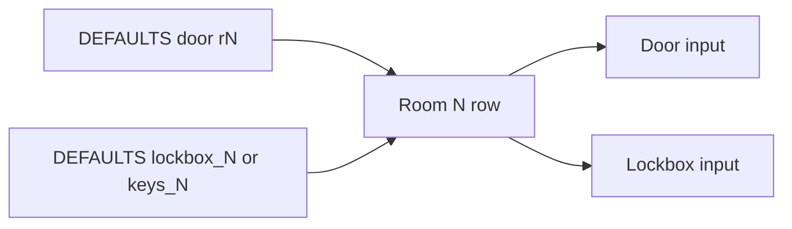

# feat: Pair room door codes and lockboxes

## Summary

Change the Codes tab so each room is one row with Door code and Lockbox side by side. Keep every value already on the site. Add the handwritten lockbox lists. Show all conflicting numbers until verification.

## Problem Frame

`docs/codes.html` renders each section as its own label-plus-input table. Parker and Burton have a separate Lockboxes section. Pioneer stores the same kind of numbers under Other as Keys. Leana, Sylvia, Ridge Oak, Greenhill, and Pebbleshores have room codes and no lockboxes. Operators cannot scan a room's door code and lockbox together. (see origin: `docs/brainstorms/2026-08-31-codes-room-lockbox-columns-requirements.md`)

## Requirements

Carried from origin.

**Layout**

- R1. Each room row shows Door code and Lockbox in two columns on the same row.
- R2. Every property uses that pairing. Pioneer Keys render as the Lockbox column.
- R3. The table is the union of room door codes and lockboxes. Extra items get a row with the missing side blank.

**Data**

- R4. Every value already on the Codes tab remains visible.
- R5. Handwritten lockbox lists are added for houses that lack lockboxes on the site.
- R6. When sources disagree, the field shows every known number until verification.

**Unchanged**

- R7. Front door, back door, masters, thermo, WiFi, contact, and notes stay in their current sections.
- R8. Lock-reset recipes, eviction process, and a WiFi/thermo cleanup are out of scope.

## Key Technical Decisions

KTD1. **One Rooms section, two value columns.** Drop the separate Lockboxes / Other tables. Render rooms as Room | Door | Lockbox. House-level sections stay single-column tables. (see origin R1, R7)

KTD2. **Reuse existing field keys.** Door inputs keep `rN`. Lockbox inputs keep `lockbox_N` where those keys already exist, and `keys_N` on Pioneer so saved Firestore values still bind. New lockboxes on houses that never had them use `lockbox_N`.

KTD3. **Do not rewrite existing conflict strings.** Leave site strings such as `0961 (or 8338?)` and `7845 (or 5613?)` unchanged. When a sheet value is new and distinct, append with the same `X (or Y?)` pattern. Do not invent a second input per conflict.

KTD4. **Empty-empty rows are omitted.** A sheet slot with no lockbox and no door code does not create a row. Pebbleshores lockbox 7 empty is skipped.

KTD5. **Codes stay out of public JSON.** Do not copy these values into `occupancy.json` or `docs/data/`. Occupancy plan already treats `codes.html` as gated and unread.

## High-Level Technical Design

Room rows are a union by room number. Door comes from current `rN` (or blank). Lockbox comes from `lockbox_N` / Pioneer `keys_N` / the pairing-table value baked into DEFAULTS (or blank).

Firestore override is unchanged: if the saved doc has the field key, that value wins, including empty string.

## Scope Boundaries

### Deferred for later

- Resolving which conflicting number is current
- Lock-reset recipes, eviction flow, WiFi/thermo cleanup

### Deferred to Follow-Up Work

- A shared test harness for other `docs/` pages
- Migrating Pioneer `keys_*` Firestore keys to `lockbox_*`

### Outside this change

- Occupancy, Discord, and scraper pipelines
- Auth, notes, and Save merge behavior

## Implementation Units

### U1. Room row layout

**Goal:** Rooms render as one row with Door code and Lockbox columns.

**Requirements:** R1, R2, R3, R7

**Dependencies:** none

**Files:** `docs/codes.html`

**Approach:** Keep the existing `<table>` renderer. Rooms sections use a header row `Room | Door code | Lockbox` and three cells per data row. Detect Rooms by `section.label === "Rooms"`. Each room field is `{ label, door: { key, value }, lockbox: { key, value } }`. Door and lockbox inputs use those keys (`rN`, `lockbox_N`, Pioneer `keys_N`) and get that column as their accessible name. A blank side still renders a keyed empty input (`r6` on Leana, `lockbox_6` on Ridge Oak). After pairing, delete standalone Lockboxes and Pioneer Other sections from DEFAULTS. House-level tables stay headerless with the current ~34% first-column rule. Room rows use a tighter first column so both code inputs can show conflict strings.

**Patterns to follow:** Existing `renderProperty` field keys, `data-prop` / `data-field`, and Save collecting every input on the property.

**Test scenarios:**

- Happy path: Parker R1 shows door `1587` and lockbox `1244` on the same row.
- Happy path: Pioneer R1 shows door `3450` and lockbox `1111` on the same row. The lockbox input still uses field key `keys_1`.
- Edge: Ridge Oak R6 shows door `3414` and a blank lockbox.
- Edge: Leana R6 shows a blank door and lockbox `4003`.
- Integration: Save still writes `rN` plus `lockbox_N` or `keys_N` with `merge: true`. A Firestore doc that already has `keys_1` still overrides the Pioneer lockbox cell.

**Verification:** Open Codes after auth. Each property's Rooms block is one table with two value columns. House-level sections are unchanged. Pioneer lockbox cells use `keys_*`.

### U2. Defaults union

**Goal:** DEFAULTS keep every current site value and add sheet lockboxes without dropping conflicts.

**Requirements:** R4, R5, R6, R8

**Dependencies:** U1 (needs paired field shape)

**Files:** `docs/codes.html`, `test_codes_room_lockbox.py`

**Approach:** Update `DEFAULTS` to the pairing table below. Do not shorten existing parenthetical conflict strings. Add `test_codes_room_lockbox.py` with a small `merge_code_values` helper that encodes KTD3, plus assertions for the pairing table (door and lockbox per slug and room). The helper is the spec; `DEFAULTS` must match it.

**Patterns to follow:** Existing conflict copy on the page ("Values in parentheses indicate known conflicting entries"). Occupancy must not receive these values.

**Test scenarios:**

- Happy path: `merge_code_values("0961 (or 8338?)", "0961")` returns `0961 (or 8338?)`.
- Happy path: `merge_code_values("2721", "2721")` returns `2721`.
- Edge: `merge_code_values("", "4003")` returns `4003`.
- Edge: `merge_code_values("0328 (or 1755?)", "0328")` returns `0328 (or 1755?)`.
- Covers AE3. Pebbleshores `front_back` remains `0961 (or 8338?)`.
- Covers AE1. Leana pairing matches the table, including R6 blank door / `4003`.
- Covers AE2. Pioneer lockboxes match Keys 1–7.

**Verification:** `python3 test_codes_room_lockbox.py` passes. `DEFAULTS` in `docs/codes.html` matches the pairing table. No codes land in `docs/data/` or occupancy.

## Pairing table (data spec)

Door values are the current website defaults. Lockbox values in **add** rows come from the handwritten sheet. Existing lockbox/keys values stay.

| Slug | Room | Door (keep) | Lockbox |
|---|---|---|---|
| leana_6623 | 1–5 | 2721, 5410, 1069, 3414, 7520 | 1010, 1320, 2121, 5011, 3002 |
| leana_6623 | 6 | blank | 4003 |
| sylvia_2516 | 1–6 | 7653, 6512, 1069, 1304, 5410, 2024 | 1212, 3112, 5132, 2100, 4245, 4011 |
| ridge_oak_10235 | 1–5 | 6510, 1304, 7653, 5410, 1069 | 2011, 2400, 1211, 5168, 3311 |
| ridge_oak_10235 | 6 | 3414 | blank |
| pebbleshores_3414 | 1–6 | `7845 (or 5613?)`, 4590, 3506, 1314, 2398, 6510 | 2100, 4132, 5111, 1111, 4019, 5168 |
| greenhill_3406 | 1–7 | 1604, 2406, 3604, 4406, 5604, 5006, 7503 | 8002, 2011, 1111, 9001, 5500, 1968, 7777 |
| parker_4351 | 1–8 | 1587, 0411, 9239, 3454, 2523, 6584, 9012, 0629 | 1244, 3344, 4011, 5312, 7233, 5168, 0228, 3211 |
| pioneer_1404 | 1–7 | 3450, 9011, 7712, `0328 (or 1755?)`, 2846, 8950, 5252 | 1111, 2010, 3111, 0400, 5115, 6330, 7222 (`keys_*`) |
| burton_5509 | 1–7 | 232323, 242424, 141414, 456090, 504530, 313131, 121212 | 1100, 2110, 3000, 4321, 5220, 6111, 7222 |
| broken_crest_1025 | 1–9 | 9119 (lockbox), 0079 (lockbox), 7633 (lockbox), 1717, 6964, 5376, 2573, 6553, 4554 | blank |

House-level fields stay as currently in `DEFAULTS`, including Pebbleshores `0961 (or 8338?)`, Sylvia WiFi `hduep3tkr77o (or hduep3tkrr77?)`, Burton thermo `3746 (or 3477?)`.

## Risks & Dependencies

- Saved Firestore values override DEFAULTS by key. A stale saved lockbox or `keys_N` will hide a new default until someone edits or clears that field. First Save after adding a new blank-side key will persist `""` the same way.
- `hasOwnProperty` treats an empty saved string as an intentional blank. Do not change that in this work.
- Discord reads `property_codes` only for `ac_filter_date`. Room/lockbox key changes do not affect that path if contact fields stay.
- `docs/codes.html` DEFAULTS are already in the public git history. This plan continues that pattern for new lockboxes. KTD5 only blocks occupancy and `docs/data/`. Seeding new lockboxes in Firestore only, and keeping literals out of git, is a product decision not taken here.

## Open Questions

- Q1. Keep new sheet lockboxes in committed DEFAULTS (current plan), or seed `lockbox_N` in Firestore only so those numbers never enter git? Existing door codes and Parker/Burton/Pioneer lockboxes already live in DEFAULTS.

## Sources & Research

- `docs/codes.html` `DEFAULTS` and `renderProperty` — current section tables and Firestore override.
- `firestore.rules` — `property_codes/{slug}` is auth-gated.
- `docs/plans/2026-08-26-001-feat-derive-occupancy-json-plan.md` — codes stay gated and unread by occupancy.
- No `docs/solutions/` learnings for this page.
