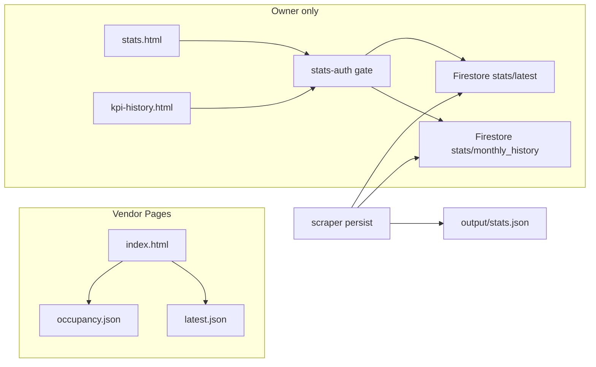

# feat: Separate login for the Stats tab

## Summary

Vendors keep occupancy and tenancy on the public dashboard. Money stays on Stats and KPI History, behind a Codes-style Firebase email/password gate that only the owner account can pass. Public Pages stops serving `stats.json` and `monthly_history.json`; those payloads move to Firestore so a login overlay cannot be bypassed by fetching the JSON.

## Problem Frame

Vendors are given the Pages dashboard. Occupancy and tenancy belong there. Room prices, earnings, Naira payout, and manager score live on `docs/stats.html` and `docs/kpi-history.html`, which currently have no auth and load public `docs/data/stats.json` / `docs/data/monthly_history.json`. A CSS gate alone does not stop a vendor from opening those JSON URLs. Occupancy collection and the private earnings scrape stay.

---

## Requirements

### Gate

- R1. `docs/stats.html` and `docs/kpi-history.html` show a Codes-style email/password gate and hide money UI until the signed-in UID matches the existing Firestore owner UID.
- R2. A vendor who is only looking at occupancy, or who is signed into another Firebase user, does not unlock Stats. Any-authenticated-user is not enough.
- R3. The Stats gate uses a named Firebase app so signing into Stats does not replace the default Auth session used by Dashboard, Codes, Vendors, or Templates.

### Data

- R4. After unlock, Stats reads `stats/latest` from Firestore and KPI History reads `stats/monthly_history`. Neither page fetches `./data/stats.json` or `./data/monthly_history.json`.
- R5. GitHub Pages no longer publishes financial JSON. `docs/data/occupancy.json` and `docs/data/latest.json` stay public. Private `padsplit_scraper/output/stats.json` stays for scrape fallback and SEO.
- R6. Morning/afternoon scrape still writes private stats JSON, then upserts both Firestore docs with the existing firebase-admin init. Firestore failure is partial-success: log and continue; do not abort occupancy.

### Non-goals preserved

- R7. Tenancy, occupancy lists, tasks, and vendor contacts stay on the existing dashboard. Do not strip earnings collection, SEO pricing, or Discord Joe-only price lines.

---

## Key Technical Decisions

- KTD1. **Reuse the owner Firebase user, do not invent a third password in the repo.** `firestore.rules` already allowlists UID `8jOJNgLoxpfyseZ0RY1PDZ1DXbi2` for codes writes. Stats uses that same UID. Occupancy has no login, so vendors never need this password. Create a stats-only Auth user later only if Codes access is ever shared with a vendor.
- KTD2. **Named Auth app `stats-auth`.** Follow the existing named-app pattern on `docs/stats.html` (`notes-stats`). Default-app `signInWithEmailAndPassword` would clobber other tabs.
- KTD3. **Unpublish plus Firestore, not overlay-only.** `docs/data/stats.json` is ~115KB and public. Store each payload as one Firestore string field (`json`) so the 1MB document limit is fine and nested-field limits are avoided. Admin SDK write; client `getDoc` after the UID check.
- KTD4. **Allowlist in rules and in the page.** Rules: `match /stats/{doc}` read/write only for the owner UID. The page also checks UID before `getDoc` so a random Firebase signup cannot unlock the UI even if signup is enabled.
- KTD5. **Keep private files on disk.** `padsplit_scraper/output/stats.json` remains the scrape fallback. Move monthly history’s source of truth to `padsplit_scraper/output/monthly_history.json` so `docs/data/` is not required for the next write. `seo_monthly.py` already prefers live rooms and can keep the output-path fallback.

---

## High-Level Technical Design

Vendor opens Dashboard, sees tenancy. Owner opens Stats, signs in on `stats-auth`, then `getDoc`. Direct `/data/stats.json` is gone after the next Pages deploy.

---

## Scope Boundaries

### In scope

- Stats and KPI History login
- Stop publishing financial JSON on Pages
- Firestore upload of those two payloads
- Tests that lock the gate, allowlist, and unpublished paths

### Out of scope

- Removing money from the scrape, SEO pack, or Obsidian digest
- Redacting tenant chat text that happens to mention payout or income
- Changing occupancy, lock codes, or field MMS
- Rewriting git history of old `stats.json` (repo is private; Pages current tree is the leak)

### Deferred to Follow-Up Work

- A dedicated stats-only Firebase user if Codes credentials are ever shared
- Encrypting or deleting historical `stats.json` blobs already in private git

---

## Implementation Units

### U1. Firestore stats docs and scrape upload

**Goal:** Private scrape output still lands on disk; Pages no longer needs those files because Firestore holds the live copies.

**Requirements:** R5, R6

**Dependencies:** none

**Files:**
- `firestore.rules`
- `padsplit_scraper/persist.py`
- `padsplit_scraper/scraper.py`
- `test_padsplit_scraper.py` or a new `test_stats_firestore.py`

**Approach:** Add `match /stats/{document}` with the same owner-UID check as `property_codes`. After `_write_json` of stats and monthly history, upsert `stats/latest` and `stats/monthly_history` as `{ json: <serialized payload>, updated_at }`. Reuse `_init_firestore_app` from `padsplit_scraper/discord_notifier.py` or the lock-codes firebase-admin block. Swallow upload errors after logging. Point `_monthly_history_path()` at `padsplit_scraper/output/monthly_history.json` and seed it from the current docs file once so history is not reset.

**Patterns to follow:** firebase-admin init and partial-success in `padsplit_scraper/lock_codes.py` / `discord_notifier.py`. Occupancy already writes a private + docs pair; stats becomes private + Firestore.

**Test scenarios:**
- Happy path: persist helper given a mock client writes `stats/latest` with the full stats payload string and `stats/monthly_history` with the months payload string.
- Edge: missing Firebase credentials skips upload and still writes `padsplit_scraper/output/stats.json`.
- Error: Firestore `set` raises; scrape helper returns without raising; occupancy persist is unaffected.
- Rules file contains `match /stats/{document}` and the owner UID; default catch-all stays deny.

**Verification:** Unit tests pass. A dry run of the helper against a fixture does not require a live Firebase project.

### U2. Stats page owner gate and Firestore read

**Goal:** The Stats tab asks for the owner email/password and only then renders prices, earnings, and payout.

**Requirements:** R1, R2, R3, R4

**Dependencies:** U1

**Files:**
- `docs/stats.html`
- `test_dashboard_occupancy_ui.py` or `test_stats_gate.py`

**Approach:** Copy the Codes gate chrome (`gate-wrap` / `app-wrap`, email + password, Unlock, error). Use `initializeApp(..., 'stats-auth')` + `getAuth` on that app. `onAuthStateChanged`: if `user.uid` is the owner UID, hide the gate, show the existing score/price UI, then `getDoc(doc(db, 'stats', 'latest'))` and `JSON.parse`. Wrong user or signed-out shows the gate and does not render money. Do not `fetch('./data/stats.json')`. Sign-out on this page signs out `stats-auth` only.

**Patterns to follow:** `docs/codes.html` gate show/hide. Existing `statsFreshness` / listed-status copy stays after unlock.

**Test scenarios:**
- Happy path: page source has the gate, `stats-auth`, owner UID check, `stats/latest`, and `getDoc`.
- Happy path: page source does not fetch `./data/stats.json`.
- Edge: occupancy dashboard tests still pass; Stats still labels listed-status vs live occupancy.
- Integration: existing `test_dashboard_occupancy_ui.py` stale-label assertions still match the unlocked markup.

**Verification:** Static HTML tests pass. Browser check: signed-out Stats shows only the gate; owner login reveals the current score card.

### U3. KPI History same gate

**Goal:** The payout charts behind Stats cannot be opened as a back door.

**Requirements:** R1, R2, R3, R4

**Dependencies:** U1, U2

**Files:**
- `docs/kpi-history.html`
- same stats-gate test file as U2

**Approach:** Same named app, same UID allowlist, same hide-until-unlock. After unlock, `getDoc` `stats/monthly_history` and keep the existing Chart.js render. Remove `fetch('./data/monthly_history.json')`.

**Patterns to follow:** U2 gate; current `init()` chart mapping.

**Test scenarios:**
- Happy path: history page has the same `stats-auth` + UID check and reads `stats/monthly_history`.
- Happy path: no `./data/monthly_history.json` fetch.
- Edge: Stats → History link still works; History still links back to Stats; both require the same unlock.

**Verification:** Static tests pass. After owner login on Stats, History loads charts; a logged-out History tab shows the gate.

### U4. Unpublish Pages financial JSON

**Goal:** The next Pages deploy cannot serve money to a vendor who skips the HTML.

**Requirements:** R5, R7

**Dependencies:** U1, U2, U3

**Files:**
- `.github/workflows/scrape.yml`
- `run_morning.sh`
- `run_afternoon.sh`
- `docs/data/stats.json` (delete or replace with a non-financial stub, then stop tracking)
- `docs/data/monthly_history.json` (same)
- `padsplit_scraper/seo_monthly.py` fallback path if it still points at `docs/data/stats.json`
- `CLAUDE.md` one-line note that Pages stats are Firestore-gated

**Approach:** Stop `cp` / `git add` of the two financial files. Keep occupancy and latest. Leave private output files in the morning commit list if they are already gitignored or already listed as private output. `seo_monthly.py` fallback reads `padsplit_scraper/output/stats.json` only. Do not rewrite git history.

**Patterns to follow:** scrape.yml already skips a missing stats copy with a warning; invert that to “do not publish.” Occupancy copy stays.

**Test scenarios:**
- Happy path: workflow and run scripts no longer stage `docs/data/stats.json` or `docs/data/monthly_history.json`.
- Happy path: they still stage `docs/data/occupancy.json` and `docs/data/latest.json`.
- Edge: `seo_monthly.py` does not require `docs/data/stats.json`.
- Integration: occupancy UI tests still find occupancy.json on the dashboard.

**Verification:** `rg` on the workflow and run scripts shows no Pages publish of financial JSON. Occupancy tests pass.

---

## Acceptance Examples

- AE1. Vendor opens the dashboard URL, sees live occupancy and rent-ready rooms, and does not see room prices or Naira payout.
- AE2. Vendor opens `stats.html` or `data/stats.json` and gets a login screen or a missing/non-financial file, not earnings.
- AE3. Owner signs into Stats with the existing owner email/password, sees the current score card and listed prices, then opens KPI History and sees payout charts.
- AE4. Owner stays signed into Codes or Dashboard in another tab while using the Stats gate.

---

## System-Wide Impact

Auth boundary splits: public tenancy vs owner money. Firestore gains a `stats` collection; rules must be deployed (`firebase deploy --only firestore:rules`) before the first client read. Scrape machines already need Firebase admin creds for lock-codes / Discord; the same env vars write stats. CI must not send field MMS and should not need the Stats password; CI may skip the Firestore upload when creds are absent.

---

## Risks & Dependencies

- Rules not deployed: owner login succeeds and `getDoc` fails. Mitigate by deploying rules in the same rollout as the HTML cutover, and keep private disk JSON so a local fallback can be added later if needed.
- First Pages deploy after U4 but before U1 upload: Stats is empty for the owner until the next successful scrape. Run one scrape (or a one-shot upload) after rules deploy.
- Cached old `stats.json` on Pages/CDN: deleting the file in the same PR is the fix; allow one deploy cycle.
- Hardcoded UID in HTML matches today’s codes rules. If that account is rotated, update rules and both pages together.

---

## Documentation / Operational Notes

- Create no password in git. Use the existing owner Firebase Auth user (same as Codes writes).
- Deploy Firestore rules once after merge.
- After merge + Mac pull, the next morning scrape should upload `stats/latest`. If Stats is needed the same day, run the scraper once on the Mac.
- Do not paste the owner password into the repo, Discord, or field MMS.

---

## Sources & Research

- `docs/codes.html` gate and `onAuthStateChanged` show/hide
- `firestore.rules` owner UID allowlist
- `docs/stats.html` `init()` currently `fetch("./data/stats.json")`; `docs/kpi-history.html` fetches `monthly_history.json`
- `padsplit_scraper/persist.py` `_build_stats_payload` / `_build_monthly_history_payload`
- `docs/index.html` footer: Pages is public; occupancy has no gate
- Firebase Admin init already in `padsplit_scraper/discord_notifier.py`
