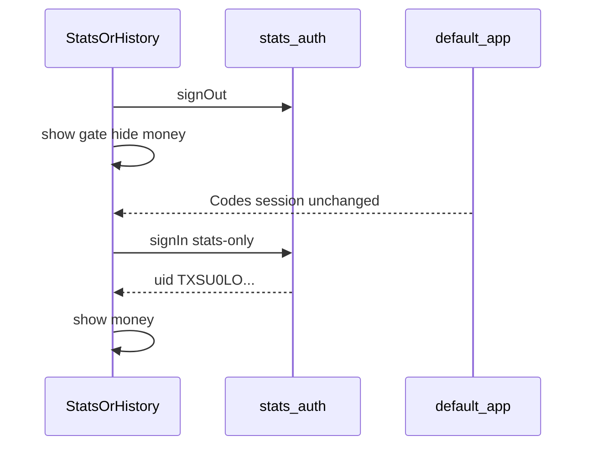

# fix: Isolate Stats from leftover Codes sessions

## Summary

Point the Stats lock at `stats-only@padsplit-scraper.com` / `TXSU0LOpmDWNBbbv0x3uHHBnZb12`. On every visit to Stats or KPI History, sign out the named `stats-auth` app so an old Codes or stale Stats session cannot auto-open money. Leave the default Firebase app (Codes, Dashboard) signed in.

## Problem Frame

The operator was already signed in elsewhere, clicked Stats, and saw prices. The live Pages site may still be the ungated page until the earlier PR lands. Even with a gate, a persisted `stats-auth` user from the Codes-UID era will unlock money if the allowlist is wrong or stale.

---

## Requirements

- R1. Opening Stats or KPI History always shows the Stats-only auth screen first. (see origin)
- R2. Only UID `TXSU0LOpmDWNBbbv0x3uHHBnZb12` unlocks those pages. (see origin D1)
- R3. A Codes / Dashboard / Vendors / Templates session does not unlock Stats. (see origin)
- R4. Arrival clears any prior `stats-auth` session so the visitor must enter the stats-only password. (see origin)
- R5. Clearing `stats-auth` does not sign out the default app. (see origin D2)
- R6. Occupancy stays public. (see origin)
- R7. No past-viewer reconstruction. (see origin D3)

---

## Key Technical Decisions

- KTD1. **Replace the allowlist UID only.** HTML and `firestore.rules` `match /stats/{document}` use `TXSU0LOpmDWNBbbv0x3uHHBnZb12`. Codes UID `8jOJNgLoxpfyseZ0RY1PDZ1DXbi2` stays on every other rule.
- KTD2. **Named app `stats-auth` is the only session we touch.** `signOut(getAuth(statsApp))` on load, then show the gate. Do not call `signOut` on the default app.
- KTD3. **Every load requires a fresh Stats password.** After `signOut`, `onAuthStateChanged` shows the gate until this visit’s `signInWithEmailAndPassword` returns the allowlisted UID. A refresh signs `stats-auth` out again. That matches origin AE1 and the “refresh still locked” success criterion.
- KTD4. **Live Pages still needs the gated HTML.** Session isolation on this branch does not hide money on the currently deployed ungated Stats page. Ship this delta with the unpublished-JSON work.

---

## High-Level Technical Design

---

## Implementation Units

### U1. Point Stats allowlist at the new UID

**Goal:** The stats-only account the operator created is the only UID that can read money.

**Requirements:** R2, R3

**Dependencies:** none

**Files:**
- `docs/stats.html`
- `docs/kpi-history.html`
- `firestore.rules`
- `test_stats_gate.py`
- `test_stats_firestore.py`

**Approach:** Replace `pcJSHjdXeDfOeGRQMgso11Gvlxh2` with `TXSU0LOpmDWNBbbv0x3uHHBnZb12` in the Stats pages and the `stats` rules match. Keep `STATS_UID` as the page constant name. Redeploy Firestore rules after merge.

**Patterns to follow:** Current `STATS_UID` check and `match /stats/{document}` owner-only rule.

**Test scenarios:**
- Happy path: both pages and the stats rules block contain `TXSU0LOpmDWNBbbv0x3uHHBnZb12`.
- Happy path: pages still use `user.uid === STATS_UID` and `stats-auth`.
- Edge: Codes UID remains in `property_codes` rules and is absent from the stats rules block.

**Verification:** Gate and rules tests pass. Stats password for the new UID is the only client that `getDoc`s `stats/latest`.

### U2. Clear `stats-auth` on arrival

**Goal:** An old Codes or stale Stats session cannot auto-unlock money.

**Requirements:** R1, R4, R5

**Dependencies:** U1

**Files:**
- `docs/stats.html`
- `docs/kpi-history.html`
- `test_stats_gate.py`

**Approach:** On module start, `await signOut(auth)` on the `stats-auth` app, then attach `onAuthStateChanged`. Signed-out or wrong UID shows the gate and keeps `#app-wrap` hidden. Successful stats-only sign-in this visit shows the app and loads Firestore. The Codes sign-out button on other pages is unchanged.

**Patterns to follow:** Existing gate show/hide in `docs/stats.html`. Named app already used for Stats so default-app Auth is a different instance.

**Test scenarios:**
- Happy path: both pages call `signOut` on the `stats-auth` auth instance before relying on `onAuthStateChanged`.
- Happy path: money markup stays inside `#app-wrap` with class `hidden` until unlock.
- Edge: page source has no `signOut` of a default/unnamed app in the Stats module.
- Integration: existing listed-status / occupancy-split copy on Stats is unchanged after unlock.

**Verification:** Static tests pass. Browser: signed into Codes, open Stats, see only the lock; enter stats-only email/password, see the score card; refresh, see the lock again.

---

## Acceptance Examples

- AE1. Codes session open, Stats click, lock screen, no prices. (origin AE1)
- AE2. `stats-only@padsplit-scraper.com` unlocks the score card. (origin AE2)
- AE3. KPI History with Codes-only session shows the same lock. (origin AE3)

---

## Risks & Dependencies

- Rules not redeployed: new UID can pass the HTML check and `getDoc` fails. Deploy `firestore.rules` with the HTML cutover.
- Ungated production Stats: isolation on this branch does not help vendors until Pages serves the gated files.

---

## Documentation / Operational Notes

- Password stays in Firebase Auth only. Never commit it.
- After merge: `firebase deploy --only firestore:rules --project padsplit-scrapper`.
- Sign in on Stats with `stats-only@padsplit-scraper.com` and the password set in the console for UID `TXSU0LOpmDWNBbbv0x3uHHBnZb12`.
