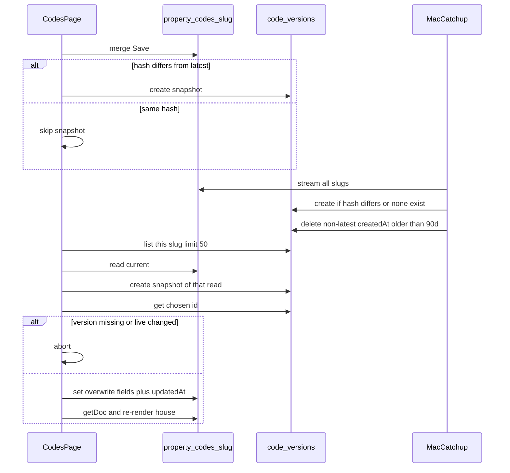

# feat: Keep restoreable Codes history

## Summary

Keep a bounded Firestore history of each house’s codes so a bad edit can be opened and restored from the Codes page. Snapshot on each Save or catch-up that changes the code map. Restore overwrites live. CI, Git, and occupancy never hold the copies.

## Problem Frame

`docs/codes.html` merge-writes `property_codes/{slug}` and `lock_codes.update_codes_page` does the same for Spanish Moss `back_door`. The last good map is gone after a bad Save. `stats/monthly_history` is a rolling month blob, not a per-save restore trail. Timestamped Git dumps are already forbidden.

---

## Requirements

### History

- R1. Every Codes Save that changes house fields writes one immutable snapshot of that house’s code map.
- R2. A Mac catch-up runs at least once a day and snapshots any `property_codes` doc whose code map is not already the latest snapshot, including `spanish_moss`.
- R3. Catch-up and page writes skip a new snapshot when the canonical hash matches the latest snapshot for that slug.
- R4. The Mac job prunes snapshots older than 90 days except the latest row per slug. Restore re-reads that document id at confirm and aborts if it is gone.
- R5. CI never writes or prunes code snapshots.

### Restore

- R6. After Codes login, each `DEFAULTS` house has a control that lists that house’s snapshots by time, on demand, at most 50 rows.
- R7. Opening a snapshot shows its field values. Empty history hides Restore.
- R8. Confirm names the house and time, that live keys absent from the snapshot will be deleted, and that unsaved edits for that house are lost. Undo is the pre-restore snapshot, not `DEFAULTS`.
- R9. Restore writes only the snapshot’s `fields` map plus a fresh `updatedAt` onto the live doc. No merge. Wrapper keys never land on live.
- R10. Restore always writes a snapshot of the live document it is about to replace. It does not hash-skip that write. It overwrites live only if the canonical hash of live still matches that read. Abort if either write fails. The house shows an error; the form stays as it was.
- R11. After a successful restore, that house’s form reloads from the live doc. Keys absent from the snapshot render empty, not `DEFAULTS` values.

### Boundaries

- R12. History uses the Codes UID `8jOJNgLoxpfyseZ0RY1PDZ1DXbi2`. Stats UID stays off this tree.
- R13. History never leaves Firestore: no local files, no occupancy/git/Discord/log payloads, no who-typed audit. Catch-up logs slug counts only. Tests use placeholders, never `DEFAULTS` PIN literals.
- R14. `notes/codes` and `lockout_reply.fetch_property_codes` stay live-only. `fetch_property_codes` keeps reading the live doc.

---

## Key Technical Decisions

- KTD1. **Subcollection `property_codes/{slug}/code_versions/{autoId}`.** A growing list on the live doc hits the 1 MiB cap and slows every lockout read. Reject a `versions` array or `{ json }` blob on the parent (`stats/monthly_history`). Reject sibling `property_codes/{slug}_v1` docs (the Codes `getDocs` and Discord stream would treat them as houses). Reject `code_versions/{contentHash}` as the id: two saves of the same map collapse, and a hash of lock codes is a secret in the path. Name the collection `code_versions`, not `versions`.
- KTD2. **Snapshot wrapper, flat live map.** History docs store `{ fields, contentHash, createdAt, expireAt, source }`. `createdAt` is server time. `expireAt` is `createdAt` plus 90 days even though prune keys on `createdAt`. Live stays the flat string map `lockout_reply.codes_from_property_doc` already reads. Reject nesting `fields` on the parent or teaching lockout/Discord to unwrap. Restore copies `fields` plus `updatedAt` only. Do not put `contentHash` / `source` / `expireAt` on live as a skip token.
- KTD3. **Hash is SHA-256 of sorted-key JSON.** Input is the full live string map minus reserved keys. Drop `updatedAt` and any wrapper key. Keep empty strings and extra keys today’s merge already persists. Page JS and Python must produce the same digest. Hashing timestamps would snapshot every Save. Hashing DEFAULTS keys only would skip extras and then overwrite-delete them.
- KTD4. **Live Save stays merge. Restore is overwrite.** Merge restore, `update()`, and merge-plus-delete-missing leave leftover PINs that lockout still sends. Making Save overwrite would drop Moss and unrendered keys. Snapshot the full live map after Save, not the form payload. Do not delete-then-recreate live (empty-doc window for lockout).
- KTD5. **Three render states.** No live doc → `DEFAULTS`. Live doc missing a key → empty. Live empty string → empty. Today’s per-missing-key fallback paints git PINs after a sparse restore. Do not treat empty string as missing.
- KTD6. **Always snapshot the live read about to be replaced.** Hash-skip is for Save/catch-up duplicates only. Skip-before-overwrite is how the only copy of current live dies.
- KTD7. **Named child rules, Codes UID equality, create + bounded list + get.** Parent `match /property_codes/{slug}` does not cover children. Reject `allow write`, `request.auth != null`, and any collection-group match. List is denied without a limit of 50 or less. Client cannot update or delete. Create accepts only the wrapper fields. Deploy rules before any `main` HTML that lists history.
- KTD8. **Mac catch-up after `lock_codes.py`, CI no-op.** Follow `runtime.running_in_ci` (zero reads/writes/deletes, skip before any stream) and `persist._firestore_client_or_none`. Admin bypasses rules, so CI safety is the code path, not the rules deploy. Do not add a send flag. Catch-up never mutates live.
- KTD9. **Prune non-latest rows by `createdAt`.** Latest per slug is kept even if older than 90 days. Seed or confirm latest exists before prune on that slug. Missing `createdAt` is not deleted. Console TTL is optional later. PITR (7 days) and scheduled backups are not this feature.
- KTD10. **`source` is page / catchup / lock_codes, not a person.** No uid or email on the snapshot.
- KTD11. **Partial Save: live stands, UI is not a clean Saved.** Catch-up backfills `live hash ≠ latest snapshot hash`. That lag is not restore-safe; R10 still applies. Do not retry-loop on the page.
- KTD12. **No History card and no client restore for `spanish_moss`.** The slug stays out of `DEFAULTS`. Catch-up still snapshots it. The page never queries that path.
- KTD13. **History list is on-demand, one slug, limit 50.** Not inside `initCodes` for every house. No collection group, no listener, no `localStorage`. Page issues the list only when `auth.currentUser.uid` is the Codes UID. List cache is not a restore grant.

---

## High-Level Technical Design

Restore never writes the history wrapper onto live. Overwrite of live does not delete `code_versions`. A list row is not a grant to apply cached fields.

---

## Scope Boundaries

- In: snapshot, list, view, confirm, restore, Mac seed/prune, rules, Codes-page control.
- Out: actor log, public history page, notes history, field-level undo, Spanish Moss card, Stats/KPI history, occupancy, git snapshots.

### Deferred to Follow-Up Work

- Console TTL on `code_versions.expireAt`.
- Immediate snapshot inside `update_codes_page` in the same Admin batch as the Moss merge (catch-up already covers that slug the same morning or afternoon).
- Per-field diff highlighting.

---

## Implementation Units

### U1. Rules and snapshot contract

**Goal:** History paths are allowlisted and the wrapper/live split is testable without a browser.

**Requirements:** R3, R9, R12, R13

**Dependencies:** none

**Files:**
- `firestore.rules`
- `padsplit_scraper/codes_history.py`
- `test_codes_history.py`
- `test_stats_firestore.py`

**Approach:** Add `match /property_codes/{slug}/code_versions/{id}` with Codes UID equality, get + bounded list + create, explicit no update/delete. Create accepts only the wrapper fields. No collection-group match. Keep the catch-all deny. Put canonicalize / hash / “restore payload is fields + updatedAt” in a small Python module. Tests use placeholders only.

**Patterns to follow:** `test_stats_firestore.py` block-split of the stats match. Isolate the `code_versions` match the same way.

**Test scenarios:**
- Happy path: the isolated `code_versions` block contains Codes UID `8jOJNgLoxpfyseZ0RY1PDZ1DXbi2` and not Stats UID `TXSU0LOpmDWNBbbv0x3uHHBnZb12`.
- Happy path: two maps that differ only in `updatedAt` hash equal.
- Happy path: restore payload has code fields and `updatedAt`, and does not include `contentHash` or `source`.
- Edge: empty-string fields and extra non-DEFAULTS keys are present in the hash input.
- Edge: the isolated block does not grant client update or delete, and list without a limit of 50 or less is not allowed.
- Error: default deny line remains.
- Error: a copied parent `allow read, write` on the child path would fail the block-split tests.

**Verification:** Rules tests pass. Hash/restore helpers never print field values.

---

### U2. Mac catch-up and prune

**Goal:** At least daily, every live house including `spanish_moss` has a latest snapshot, and non-latest rows older than 90 days are gone.

**Requirements:** R2, R3, R4, R5, R13

**Dependencies:** U1

**Files:**
- `padsplit_scraper/codes_history.py`
- `run_morning.sh`
- `run_afternoon.sh`
- `.github/workflows/scrape.yml`
- `test_codes_history.py`
- `test_stats_firestore.py`

**Approach:** Stream `property_codes`. For each doc, snapshot when there is no latest row or the hash differs. `source` is `catchup`. Seed or confirm latest exists, then delete non-latest rows with `createdAt` older than 90 days. Missing `createdAt` is kept. CI skip happens before any stream. Missing Admin creds skip without failing the rest of the morning/afternoon run. Reuse persist’s client helper. Do not add the module to scrape CI or the git commit lists. Admin may create and prune only, never update a snapshot.

**Patterns to follow:** `persist._firestore_client_or_none`; `lock_codes` CI skip returns 0 and does no work; `test_stats_firestore.py` string asserts on `run_morning.sh` / `scrape.yml`.

**Execution note:** Implement the catch-up function test-first with a fake Firestore client.

**Test scenarios:**
- Happy path: live hash differs → one new `code_versions` doc; live doc unchanged.
- Happy path: live hash equals latest → no write.
- Happy path: no snapshots yet → seed one from current live.
- Edge: stream includes `spanish_moss`.
- Edge: a non-latest row older than 90 days is deleted; a 10-day row is kept; a latest row older than 90 days is kept.
- Edge: missing `createdAt` is not deleted.
- Error: CI environ → zero reads, writes, and deletes.
- Error: no credentials → skip, no exception.
- Integration: morning and afternoon scripts name the phase after lock codes; `scrape.yml` and both git add lists do not.

**Verification:** Next Mac morning/afternoon runs the phase after lock codes. First CI scrape after merge does not increase `code_versions`.

---

### U3. Codes page history and restore

**Goal:** A signed-in operator can open previous codes for a `DEFAULTS` house and restore one.

**Requirements:** R1, R3, R6, R7, R8, R9, R10, R14

**Dependencies:** U1

**Files:**
- `docs/codes.html`
- `test_codes_dashboard.py`
- `test_codes_dashboard_render.mjs`

**Approach:** Inject a Previous control next to Save from `initCodes` after `renderProperty` so the `OVERDUE_DAYS`…`initCodes()` extract stays Firestore-free. Opening it shows a read-only dated list in that house body. Save snapshot and restore handlers stay in `initCodes`. Codes UID check before list, snapshot create, and restore. JS SHA-256 canonicalize matches U1. Named restore write, distinct from merge Save. Always snapshot the current live read, re-get the chosen id, then overwrite if the live hash is unchanged. Abort shows an error on that house; form unchanged. Confirm uses the existing in-page button pattern with the R8 copy (house, time, deleted keys, unsaved edits). After restore, re-`getDoc` and re-render; DEFAULTS fallback stays as today until U4. Live success + snapshot fail is not Saved ✓. List is per-slug, limit 50. No `spanish_moss` query. Do not log field values.

**Patterns to follow:** `test_firestore_merge_and_gate_unchanged`; renderer slice `OVERDUE_DAYS`…`initCodes()`; never print field values.

**Execution note:** Extend HTML string tests before changing Save/restore behavior.

**Test scenarios:**
- Happy path: page contains a Previous/History control and `code_versions`.
- Happy path: live Save still uses `doc(db, 'property_codes', slug)` and `{ merge: true }`.
- Happy path: named restore write for that slug has no merge option.
- Happy path: restore payload in page source is fields plus `updatedAt`, without wrapper keys.
- Happy path: confirm copy names house, time, deleted live keys, and unsaved edits.
- Happy path: JS hash helper drops `updatedAt`.
- Edge: empty history has no Restore.
- Edge: hash-equal Save creates no snapshot.
- Edge: confirm cancel performs no live overwrite.
- Edge: `spanish_moss` stays out of `DEFAULTS`.
- Error: live Save ok + snapshot fail is not Saved ✓.
- Error: pre-restore snapshot fail or missing version id performs no overwrite.
- Integration: occupancy JSON still has no `lockbox_`, `room_code`, `wifi_`, or `code_versions`.
- Integration: `notes/codes` path and gate unchanged.

**Verification:** Codes structure tests and the renderer extract pass. Manual Codes login can open a snapshot after a Save.

---

### U4. Load and DEFAULTS fallback

**Goal:** A restored house does not grow leftover keys or hardcoded PIN fallbacks on the next Save.

**Requirements:** R11

**Dependencies:** U3

**Files:**
- `docs/codes.html`
- `test_codes_dashboard.py`
- `test_codes_dashboard_render.mjs`

**Approach:** When a live doc exists, missing keys render as empty. `DEFAULTS` `value` fills only a house with no live doc. Empty string stays empty. After restore, disable Save until that house has re-rendered. Do not change `DEFAULTS` literals. `initCodes` must not collapse a missing slug and an empty live doc into the same object if that would hide the split.

**Patterns to follow:** Dummy-house renderer test with a live-shaped object, not only `{}`.

**Test scenarios:**
- Happy path: dummy house with a live doc missing a key whose DEFAULTS value is non-empty does not emit that DEFAULTS value.
- Happy path: dummy house with no live doc still uses DEFAULTS.
- Edge: live empty string stays empty.
- Edge: `test_existing_default_values_unchanged` still passes.

**Verification:** Renderer extract encodes the live-doc vs empty-doc split.

---

## Acceptance Examples

- AE1. Operator Save changes room 3, then Save again with a typo. Previous shows both times. Restore of the first overwrites live. Lockout’s next `fetch_property_codes` sees the first map, not the typo.
- AE2. Operator Save with no field changes. `updatedAt` may move. No new `code_versions` row.
- AE3. First Mac run after deploy. Each existing live doc including `spanish_moss` gets one seed snapshot of whatever is live now, including a bad Save that has no earlier row. No live fields change.
- AE4. Restore confirm cancelled. Live and the form stay as they were.
- AE5. Snapshot create fails after a good merge Save. UI is not Saved ✓. Next Mac catch-up writes the missing row.

---

## System-Wide Impact

- **Auth:** Codes UID equality on the page list and in rules. Stats named-app isolation stays. Default-app `showApp()` is not a security boundary; a non-Codes UID must not issue the history list.
- **Lockout / leak:** `fetch_property_codes` stays a live `get()`. Do not unwrap `fields`. Wrapper-on-live looks like missing door codes. Merge leftovers look like success with the wrong PIN. Spanish Moss send-time back door stays Sifely.
- **Discord AC dates:** parent stream never sees subcollections. Overwrite of a snapshot that omitted `ac_filter_date` drops overdue. Snapshot the full live map, including Contact and house-note keys. `discord_notifier` must not read `code_versions`.
- **Notes:** `notes/codes` is a different document. Per-house notes on the property doc are in `fields`.
- **Occupancy / Pages JSON / git:** no import of the history module, no new commit paths, no `docs/data/` copies.
- **Launchd:** one extra continue-on-failure phase after lock codes. It must not mutate live and must not block lockout/leak. Scrape CI already has Admin JSON; do not wire the module there.

---

## Risks & Dependencies

- Pages and rules are not one publish. Rules first is the only safe direction. HTML first looks like failed History; Restore aborts at pre-snapshot.
- Admin catch-up ignores rules. CI safety is `runtime.running_in_ci` plus not wiring the module into scrape.
- Rollback: revert Pages HTML, confirm the live Codes URL is the old file, stop the Mac phase, then revert rules. Do not bulk-delete `code_versions` unless destroying copies on purpose. A completed Restore is not undone by reverting HTML.
- Overwrite restore deletes keys the snapshot lacks. Confirm copy must say so. Recovery is the pre-restore row.
- Wrapper keys on a live doc are an incident. Lockout then misses top-level door keys.
- Restore without U4 paints `DEFAULTS` PINs on the next Save.
- Unbounded history list downloads 90 days of PINs. Limit 50, on-demand, one slug.
- Hash-skip races: duplicate same-hash rows are fine. Skipping the pre-restore snapshot is not.
- First prune is the first real history loss. Latest-per-slug must survive. PITR is 7 days.
- `DEFAULTS` already embed fallback values in git. Do not add history fixtures beside them. `redact_for_log` does not hide Wi‑Fi strings.

---

## Documentation / Operational Notes

- Deploy rules to `padsplit-scrapper` before Pages HTML. Playground: Codes UID can create/get/list `code_versions`; cannot update/delete; Stats UID and signed-out are deny.
- Publish Codes HTML only after that match is live. Confirm the live URL is the new file. U4 ships in the same HTML cutover as Restore.
- Next launchd morning/afternoon `pull --rebase` picks up the phase. No new plist. CI must not gain that phase.
- Rollback: Pages HTML → old Codes URL → stop Mac catch-up → revert rules.
- README: Previous/History is on the gated page; copies live in Firestore for 90 days; occupancy and Git stay code-free.
- First useful history for houses not Saved after deploy is the first Mac catch-up seed, including `spanish_moss`. Empty History before that is expected.
- Watch the first Mac slot and the first CI scrape. CI `code_versions` count must stay at baseline. Any live wrapper key is a stop.

---

## Sources & Research

- Live overwrite: `docs/codes.html` Save `setDoc` merge; `padsplit_scraper/lock_codes.py` `update_codes_page`.
- Rules default deny: `firestore.rules`.
- Adjacent non-template: `padsplit_scraper/persist.py` `stats/monthly_history`.
- Isolation: `docs/plans/2026-09-19-002-fix-stats-session-isolation-plan.md`.
- No git dumps: `CLAUDE.md`; `REFACTOR-AUDIT-2026-07-18.md`.
- Official: [Structure data](https://firebase.google.com/docs/firestore/manage-data/structure-data), [set vs merge](https://firebase.google.com/docs/firestore/manage-data/add-data), [subcollections survive parent overwrite](https://firebase.google.com/docs/firestore/manage-data/delete-data), [TTL](https://firebase.google.com/docs/firestore/ttl), [PITR is 7 days](https://firebase.google.com/docs/firestore/pitr), [rules do not inherit](https://firebase.google.com/docs/firestore/security/rules-structure).
